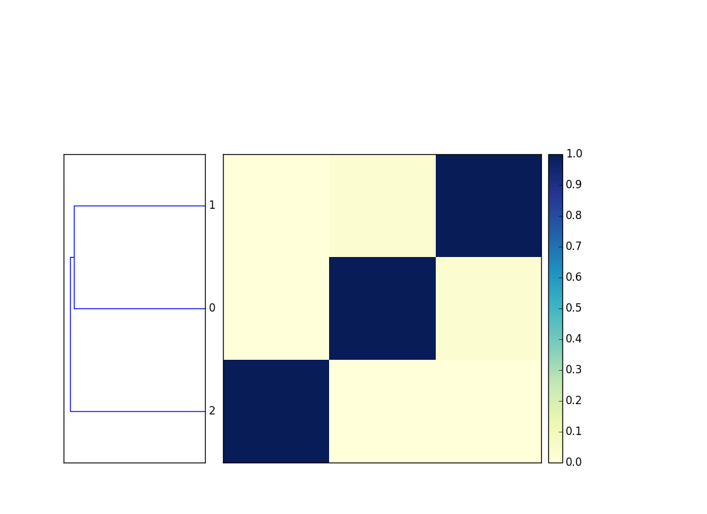

# Using sourmash from the command line

From the command line, sourmash can be used to compute
[MinHash sketches][0] from DNA sequences, compare them to each other,
and plot the results; these sketches are saved into "signature files".
These signatures allow you to estimate sequence similarity quickly and
accurately in large collections, among other capabilities.

Please see the [mash software][1] and the
[mash paper (Ondov et al., 2016)][2] for background information on
how and why MinHash sketches work.


sourmash uses a subcommand syntax, so all commands start with
`sourmash` followed by a subcommand specifying the action to be
taken.

## An example

Grab three bacterial genomes from NCBI:
```
curl -L -O ftp://ftp.ncbi.nlm.nih.gov/genomes/refseq/bacteria/Escherichia_coli/reference/GCF_000005845.2_ASM584v2/GCF_000005845.2_ASM584v2_genomic.fna.gz
curl -L -O ftp://ftp.ncbi.nlm.nih.gov/genomes/refseq/bacteria/Salmonella_enterica/reference/GCF_000006945.2_ASM694v2/GCF_000006945.2_ASM694v2_genomic.fna.gz
curl -L -O ftp://ftp.ncbi.nlm.nih.gov/genomes/refseq/bacteria/Sphingobacteriaceae_bacterium_DW12/latest_assembly_versions/GCF_000783305.1_ASM78330v1/GCF_000783305.1_ASM78330v1_genomic.fna.gz
```
Compute signatures for each:
```
   sourmash compute -k 31 *.fna.gz
```
This will produce three `.sig` files containing MinHash signatures at k=31.

Next, compare all the signatures to each other:
```
sourmash compare *.sig -o cmp
```

Optionally, parallelize compare to 8 threads with `-p 8`:

```
sourmash compare -p 8 *.sig -o cmp
```

Finally, plot a dendrogram:
```
sourmash plot cmp --labels
```
This will output two files, `cmp.dendro.png` and `cmp.matrix.png`,
containing a clustering & dendrogram of the sequences, as well as a
similarity matrix and heatmap.

Matrix:



## The `sourmash` command and its subcommands

To get a list of subcommands, run `sourmash` without any arguments.

There are five main subcommands: `compute`, `compare`, `plot`,
`search`, and `gather`.  See [the tutorial](tutorials.html) for a
walkthrough of these commands.

* `compute` creates signatures.
* `compare` compares signatures and builds a distance matrix.
* `plot` plots distance matrices created by `compare`.
* `search` finds matches to a query signature in a collection of signatures.
* `gather` finds non-overlapping matches to a metagenome in a collection of signatures.

There are also a number of commands that work with taxonomic
information; these are grouped under the `sourmash lca`
subcommand. See [the LCA tutorial](tutorials-lca.html) for a
walkthrough of these commands.

* `lca classify` classifies many signatures against an LCA database.
* `lca summarize` summarizes the content of a metagenome using an LCA database.
* `lca gather` finds non-overlapping matches to a metagenome in an LCA database.
* `lca index` creates a database for use with LCA subcommands.
* `lca rankinfo` summarizes the content of a database.
* `lca compare_csv` compares lineage spreadsheets, e.g. those output by `lca classify`.

Finally, there are a number of utility and information commands:

* `info` shows version and software information.
* `index` indexes many signatures using a Sequence Bloom Tree (SBT).
* `sbt_combine` combines multiple SBTs.
* `categorize` is an experimental command to categorize many signatures.
* `watch` is an experimental command to classify a stream of sequencing data.

### `sourmash compute`

The `compute` subcommand computes and saves signatures for
each sequence in one or more sequence files.  It takes as input FASTA
or FASTQ files, and these files can be uncompressed or compressed with
gzip or bzip2.  The output will be one or more JSON signature files
that can be used with `sourmash compare`.

Please see [Using sourmash: a practical guide](using-sourmash-a-guide.md)
for more information on computing signatures.

______

Usage:
```
sourmash compute filename [ filename2 ... ]
```
Optional arguments:
```
--ksizes K1[,K2,K3] -- one or more k-mer sizes to use; default is 31
--force -- recompute existing signatures; convert non-DNA characters to N
--output -- save all the signatures to this file; can be '-' for stdout.
--track-abundance -- compute and save k-mer abundances.
--name-from-first -- name the signature based on the first sequence in the file
--singleton -- instead of computing a single signature for each input file,
               compute one for each sequence
--merged <name> -- compute a single signature for all of the input files,
                   naming it <name>
```
### `sourmash compare`


The `compare` subcommand compares one or more signature files
(created with `compute`) using estimated [Jaccard index][3].
  The default output
is a text display of a similarity matrix where each entry `[i, j]`
contains the estimated Jaccard index between input signature `i` and
input signature `j`.  The output matrix can be saved to a file
with `--output` and used with the `sourmash plot` subcommand (or loaded
with `numpy.load(...)`.  Using `--csv` will output a CSV file that can
be loaded into other languages than Python, such as R.

Usage:
```
sourmash compare file1.sig [ file2.sig ... ]
```

Options:
```
--output -- save the distance matrix to this file (as a numpy binary matrix)
--ksize -- do the comparisons at this k-mer size.
```

### `sourmash plot`

The `plot` subcommand produces two plots -- a dendrogram and a
dendrogram+matrix -- from a distance matrix computed by `sourmash compare
--output <matrix>`.  The default output is two PNG files.

Usage:
```
sourmash plot <matrix>
```

Options:
```
--pdf -- output PDF files.
--labels -- display the signature names (by default, the filenames) on the plot
--indices -- turn off index display on the plot.
--vmax -- maximum value (default 1.0) for heatmap.
--vmin -- minimum value (default 0.0) for heatmap.
--subsample=<N> -- plot a maximum of <N> samples, randomly chosen.
--subsample-seed=<seed> -- seed for pseudorandom number generator.
```

Example output:


### `sourmash search`

The `search` subcommand searches a collection of signatures or SBTs for
matches to the query signature.  It can search for matches with either
high [Jaccard similarity](https://en.wikipedia.org/wiki/Jaccard_index)
or containment; the default is to use Jaccard similarity, unless
`--containment` is specified.  `-o/--output` will create a CSV file
containing the matches.

`search` will load all of provided signatures into memory, which can
be slow and somewhat memory intensive for large collections.  You can
use `sourmash index` to create a Sequence Bloom Tree (SBT) that can
be quickly searched on disk; this is [the same format in which we provide
GenBank and other databases](databases.html).

Usage:
```
sourmash search query.sig [ list of signatures or SBTs ]
```

Example output:

```
49 matches; showing first 20:
similarity   match
----------   -----
 75.4%       NZ_JMGW01000001.1 Escherichia coli 1-176-05_S4_C2 e117605...
 72.2%       NZ_GG774190.1 Escherichia coli MS 196-1 Scfld2538, whole ...
 71.4%       NZ_JMGU01000001.1 Escherichia coli 2-011-08_S3_C2 e201108...
 70.1%       NZ_JHRU01000001.1 Escherichia coli strain 100854 100854_1...
 69.0%       NZ_JH659569.1 Escherichia coli M919 supercont2.1, whole g...
...    
```

### `sourmash gather`

The `gather` subcommand finds all non-overlapping matches to the
query.  This is specifically meant for metagenome and genome bin
analysis.  (See [Classifying Signatures](classifying-signatures.html)
for more information on the different approaches that can be used
here.)

If the input signature was computed with `--track-abundance`, output
will be abundance weighted (unless `--ignore-abundances` is
specified).  `-o/--output` will create a CSV file containing the
matches.

`gather`, like `search`, will load all of provided signatures into
memory.  You can use `sourmash index` to create a Sequence Bloom Tree
(SBT) that can be quickly searched on disk; this is
[the same format in which we provide GenBank and other databases](databases.html).

Usage:
```
sourmash gather query.sig [ list of signatures or SBTs ]
```

Example output:
```
overlap     p_query p_match 
---------   ------- --------
1.4 Mbp      11.0%   58.0%      JANA01000001.1 Fusobacterium sp. OBRC...
1.0 Mbp       7.7%   25.9%      CP001957.1 Haloferax volcanii DS2 pla...
0.9 Mbp       7.4%   11.8%      BA000019.2 Nostoc sp. PCC 7120 DNA, c...
0.7 Mbp       5.9%   23.0%      FOVK01000036.1 Proteiniclasticum rumi...
0.7 Mbp       5.3%   17.6%      AE017285.1 Desulfovibrio vulgaris sub...
```

Note:

Use `sourmash gather` to classify a metagenome against a collection of
genomes with no (or incomplete) taxonomic information.  Use `sourmash
lca summarize` and `sourmash lca gather` to classify a metagenome
using a collection of genomes with taxonomic information.

## `sourmash lca` subcommands for taxonomic classification

These commands use LCA databases (created with `lca index`, below, or
prepared databases such as
[genbank-k31.lca.json.gz](databases.html)).

### `sourmash lca classify`

`sourmash lca classify` classifies one or more signatures using the given
list of LCA DBs. It is meant for classifying metagenome-assembled genome
bins (MAGs) and single-cell genomes (SAGs).

Usage:

```
sourmash lca classify --query query.sig [query2.sig ...] --db <lca db> [<lca db2> ...]
```

For example, the command

```
sourmash lca classify --query tests/test-data/63.fa.sig \
    --db podar-ref.lca.json 
```

will produce the following logging to stderr:

```
loaded 1 LCA databases. ksize=31, scaled=10000
finding query signatures...
outputting classifications to stdout
... classifying NC_011663.1 Shewanella baltica OS223, complete genome
classified 1 signatures total
```

and the example classification output is a CSV file with headers:

```
ID,status,superkingdom,phylum,class,order,family,genus,species
"NC_009665.1 Shewanella baltica OS185, complete genome",found,Bacteria,Proteobacteria,Gammaproteobacteria,Alteromonadales,Shewanellaceae,Shewanella,Shewanella baltica
```

The `status` column in the classification output can take three
possible values: `nomatch`, `found`, and `disagree`.  `nomatch` means
that no match was found for this query, and `found` means that an
unambiguous assignment was found - all k-mers were classified within
the same taxonomic hierarchy, and the most detailed lineage available
was reported.  `disagree` means that there was a taxonomic disagreement,
and the lowest compatible taxonomic node was reported.

To elaborate on this a bit, suppose that all of the k-mers within a
signature were classified as family *Shewanellaceae*, genus
*Shewanella*, or species *Shewanella baltica*. Then the lowest
compatible node (here species *Shewanella baltica*) would be reported,
and the status of the classification would be `found`.  However, if a
number of additional k-mers in the input signature were classified as
*Shewanella oneidensis*, sourmash would be unable to resolve the
taxonomic assignment below genus *Shewanella* and it would report
a status of `disagree` with the genus-level assignment of *Shewanella*;
species level assignments would not be reported.

(This is the approach that Kraken and other lowest common ancestor
implementations use, we believe.)

### `sourmash lca summarize`

`sourmash lca summarize` produces a Kraken-style summary of the
combined contents of the given query signatures.  It is meant for
exploring metagenomes and metagenome-assembled genome bins.

Note, unlike `sourmash lca classify`, `lca summarize` merges all
of the query signatures into one and reports on the combined contents.
This may be changed in the future.

Usage:

```
sourmash lca summarize --query query.sig [query2.sig ...] 
    --db <lca db> [<lca db2> ...]
```

For example, the command line:

```
sourmash lca summarize --query tests/test-data/63.fa.sig \
    --db tests/test-data/podar-ref.lca.json 
```

will produce the following log output to stderr:

```
loaded 1 LCA databases. ksize=31, scaled=10000
finding query signatures...
loaded 1 signatures from 1 files total.
```

and the following example summarize output to stdout:

```
50.5%   278   Bacteria;Proteobacteria;Gammaproteobacteria;Alteromonadales;Shewanellaceae;Shewanella;Shewanella baltica;Shewanella baltica OS223
100.0%   550   Bacteria;Proteobacteria;Gammaproteobacteria;Alteromonadales;Shewanellaceae;Shewanella;Shewanella baltica
100.0%   550   Bacteria;Proteobacteria;Gammaproteobacteria;Alteromonadales;Shewanellaceae;Shewanella
100.0%   550   Bacteria;Proteobacteria;Gammaproteobacteria;Alteromonadales;Shewanellaceae
100.0%   550   Bacteria;Proteobacteria;Gammaproteobacteria;Alteromonadales
100.0%   550   Bacteria;Proteobacteria;Gammaproteobacteria
100.0%   550   Bacteria;Proteobacteria
100.0%   550   Bacteria
```

The output is space-separated and consists of three columns: the
percentage of total k-mers that have this classification; the number of
k-mers that have this classification; and the lineage classification.
K-mer classifications are reported hierarchically, so the percentages
and totals contain all assignments that are at a lower taxonomic level -
e.g. *Bacteria*, above, contains all the k-mers in *Bacteria;Proteobacteria*.

The same information is reported in a CSV file if `-o/--output` is used.

### `sourmash lca gather`

The `sourmash lca gather` command finds all non-overlapping
matches to the query, similar to the `sourmash gather` command.  This
is specifically meant for metagenome and genome bin analysis.  (See
[Classifying Signatures](classifying-signatures.html) for more
information on the different approaches that can be used here.)

If the input signature was computed with `--track-abundance`, output
will be abundance weighted (unless `--ignore-abundances` is
specified).  `-o/--output` will create a CSV file containing the
matches.

Usage:

```
sourmash lca gather query.sig [<lca database> ...]
```

Example output:

```
overlap     p_query p_match
---------   ------- --------
1.8 Mbp      14.6%    9.1%      Fusobacterium nucleatum
1.0 Mbp       7.8%   16.3%      Proteiniclasticum ruminis
1.0 Mbp       7.7%   25.9%      Haloferax volcanii
0.9 Mbp       7.4%   11.8%      Nostoc sp. PCC 7120
0.9 Mbp       7.0%    5.8%      Shewanella baltica
0.8 Mbp       6.0%    8.6%      Desulfovibrio vulgaris
0.6 Mbp       4.9%   12.6%      Thermus thermophilus
```

### `sourmash lca index`

The `sourmash lca index` command creates an LCA database from
a lineage spreadsheet and a collection of signatures.  This can be used
to create LCA databases from private collections of genomes, and can
also be used to create databases for e.g. subsets of GenBank.

See [the `sourmash lca` tutorial](tutorials-lca.html) and the blog
post
[Why are taxonomic assignments so different for Tara bins?](http://ivory.idyll.org/blog/2017-taxonomic-disagreements-in-tara-mags.html)
for some use cases.

If you are interested in preparing lineage spreadsheets from GenBank
genomes (or building off of NCBI taxonomies more generally), please
see
[the NCBI lineage repository](https://github.com/dib-lab/2018-ncbi-lineages).

### `sourmash lca rankinfo`

The `sourmash lca rankinfo` command displays k-mer specificity
information for one or more LCA databases.  See the blog post
[How specific are k-mers for taxonomic assignment of microbes, anyway?](http://ivory.idyll.org/blog/2017-how-specific-kmers.html) for example output.

### `sourmash lca compare_csv`

The `sourmash lca compare_csv` command compares two lineage
spreadsheets (such as those output by `sourmash lca classify` or taken
as input by `sourmash lca index`) and summarizes their
agreement/disagreement.  Please see the blog post
[Why are taxonomic assignments so different for Tara bins?](http://ivory.idyll.org/blog/2017-taxonomic-disagreements-in-tara-mags.html)
for an example use case.

[0]:https://en.wikipedia.org/wiki/MinHash   
[1]:http://mash.readthedocs.io/en/latest/__
[2]:http://biorxiv.org/content/early/2015/10/26/029827
[3]:https://en.wikipedia.org/wiki/Jaccard_index

## `sourmash signature` subcommands for signature manipulation

These commands manipulate signatures from the command line. Currently
supported subcommands are `merge`, `rename`, `intersect`,
`extract`, `downsample`, `subtract`, `import`, `export`, `info`,
`flatten`, and `filter`.

The signature commands that combine or otherwise have multiple
signatures interacting (`merge`, `intersect`, `subtract`) work only on
compatible signatures, where the k-mer size and nucleotide/protein
sequences match each other.  If working directly with the hash values
(e.g. `merge`, `intersect`, `subtract`) then the scaled values must
also match; you can use `downsample` to convert a bunch of samples to
the same scaled value.

If there are multiple signatures in a file with different ksizes and/or
from nucleotide and protein sequences, you can choose amongst them with
`-k/--ksize` and `--dna` or `--protein`, as with other sourmash commands
such as `search`, `gather`, and `compare`.

Note, you can use `sourmash sig` as shorthand for all of these commands.

### `sourmash signature merge`

Merge two (or more) signatures.

For example,
```
sourmash signature merge file1.sig file2.sig -o merged.sig
```
will output the union of all the hashes in `file1.sig` and `file2.sig`
to `merged.sig`.

All of the signatures passed to merge must either have been computed
with `--track-abundance`, or not.  If they have `track_abundance` on,
then the merged signature will have the sum of all abundances across
the individual signatures.  The `--flatten` flag will override this
behavior and allow merging of mixtures by removing all abundances.

### `sourmash signature rename`

Rename the display name for one or more signatures - this is the name
output for matches in `compare`, `search`, `gather`, etc.

For example,
```
sourmash signature rename file1.sig "new name" -o renamed.sig
```
will place a renamed copy of the hashes in `file1.sig` in the file
`renamed.sig`. If you provide multiple signatures, all will be renamed
to the same name.

### `sourmash signature subtract`

Subtract all of the hash values from one signature that are in one or more
of the others.

For example,

```
sourmash signature subtract file1.sig file2.sig file3.sig -o subtracted.sig
```
will subtract all of the hashes in `file2.sig` and `file3.sig` from
`file1.sig`, and save the new signature to `subtracted.sig`.

To use `subtract` on signatures calculated with
`--track-abundance`, you must specify `--flatten`.

### `sourmash signature intersect`

Output the intersection of the hash values in multiple signature files.

For example,

```
sourmash signature intersect file1.sig file2.sig file3.sig -o intersect.sig
```
will output the intersection of all the hashes in those three files to
`intersect.sig`.

The `intersect` command flattens all signatures, i.e. the abundances
in any signatures will be ignored and the output signature will have
`track_abundance` turned off.

### `sourmash signature downsample`

Downsample one or more signatures.

With `downsample`, you can --

* increase the `--scaled` value for a signature computed with `--scaled`, shrinking it in size;
* decrease the `num` value for a traditional num MinHash, shrinking it in size;
* try to convert a `--scaled` signature to a `num` signature;
* try to convert a `num` signature to a `--scaled` signature.

For example,
```
sourmash signature downsample file1.sig file2.sig --scaled 100000 -o downsampled.sig
```
will output each signature, downsampled to a scaled value of 100000, to
`downsampled.sig`; and
```
sourmash signature downsample --num 500 scaled_file.sig -o downsampled.sig
```
will try to convert a scaled MinHash to a num MinHash.

### `sourmash signature extract`

Extract the specified signature(s) from a collection of signatures.

For example,
```
sourmash signature extract *.sig -k 21 --dna -o extracted.sig
```
will extract all nucleotide signatures calculated at k=21 from all
.sig files in the current directory.

There are currently two other useful selectors for `extract`: you can specify
(part of) an md5sum, as output in the CSVs produced by `search` and `gather`;
and you can specify (part of) a name.

For example,
```
sourmash signature extract tests/test-data/*.fa.sig --md5 09a0869
```
will extract the signature from `47.fa.sig` which has an md5sum of
`09a08691ce52952152f0e866a59f6261`; and 
```
sourmash signature extract tests/test-data/*.fa.sig --name NC_009665
```
will extract the same signature, which has an accession number of
`NC_009665.1`.

### `sourmash signature flatten`

Flatten the specified signature(s), removing abundances and setting
track_abundance to False.

For example,
```
sourmash signature flatten *.sig -o flattened.sig
```
will remove all abundances from all of the .sig files in the current
directory.

The `flatten` command accepts the same selectors as `extract`.

### `sourmash signature filter`

Filter the hashes in the specified signature(s) by abundance, by either
`-m/--min-abundance` or `-M/--max-abundance` or both. Abundance selection is
inclusive, so `-m 2 -M 5` will select hashes with abundance greater than
or equal to 2, and less than or equal to 5.

For example,
```
sourmash signature -m 2 *.sig
```

will output new signatures containing only hashes that occur two or
more times in each signature.

The `filter` command accepts the same selectors as `extract`.

### `sourmash signature import`

Import signatures into sourmash format. Currently only supports mash,
and can import mash sketches output by `mash info -d <filename.msh>`.

For example,
```
sourmash signature import filename.msh.json -o imported.sig
```
will import the contents of `filename.msh.json` into `imported.sig`.

### `sourmash signature export`

Export signatures from sourmash format. Currently only supports
mash dump format.

For example,
```
sourmash signature export filename.sig -o filename.sig.msh.json
```

### `sourmash signature overlap`

Display a detailed comparison of two signatures. This computes the
Jaccard similarity (as in `sourmash compare` or `sourmash search`) and
the Jaccard containment in both directions (as with `--containment`).
It also displays the number of hash values in the union and
intersection of the two signatures, as well as the number of disjoint
hash values in each signature.

This command has two uses - first, it is helpful for understanding how
similarity and containment are calculated, and second, it is useful for
analyzing signatures with very small overlaps, where the similarity
and/or containment might be very close to zero.

For example,
```
sourmash signature overlap file1.sig file2.sig
```
will display the detailed comparison of `file1.sig` and `file2.sig`.
