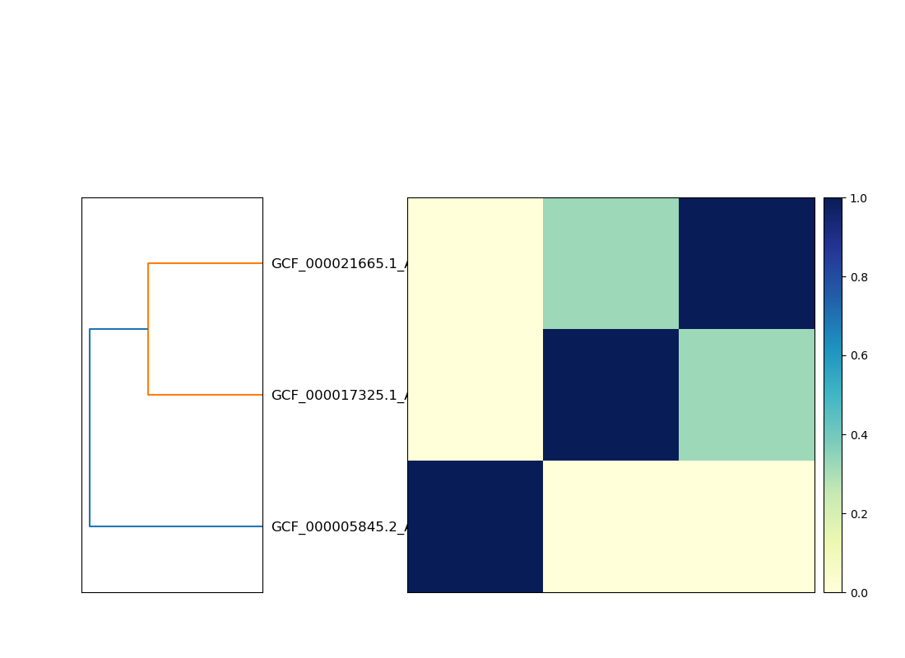

# Using sourmash from the command line

```{contents} Contents
:depth: 3
```

From the command line, sourmash can be used to create
[MinHash sketches][0] from DNA and protein sequences, compare them to
each other, and plot the results; these sketches are saved into
"signature files".  These signatures allow you to estimate sequence
similarity and containment quickly and accurately in large
collections, among other capabilities.

sourmash also provides a suite of metagenome functionality.  This
includes genome search in metagenomes, metagenome decomposition into a
list of genomes from a database, and taxonomic classification
functionality.

Please see the [mash software][1] and the
[mash paper (Ondov et al., 2016)][2] for background information on
how and why MinHash sketches work. The [FracMinHash preprint (Irber et al,
2022)](https://www.biorxiv.org/content/10.1101/2022.01.11.475838) describes
FracMinHash sketches as well as the metagenome-focused features of sourmash.

sourmash uses a subcommand syntax, so all commands start with
`sourmash` followed by a subcommand specifying the action to be
taken.

## An example

Download three bacterial genomes from NCBI:
```
curl -L -O https://ftp.ncbi.nlm.nih.gov/genomes/all/GCF/000/017/325/GCF_000017325.1_ASM1732v1/GCF_000017325.1_ASM1732v1_genomic.fna.gz
curl -L -O https://ftp.ncbi.nlm.nih.gov/genomes/all/GCF/000/021/665/GCF_000021665.1_ASM2166v1/GCF_000021665.1_ASM2166v1_genomic.fna.gz
curl -L -O https://ftp.ncbi.nlm.nih.gov/genomes/refseq/bacteria/Escherichia_coli/reference/GCF_000005845.2_ASM584v2/GCF_000005845.2_ASM584v2_genomic.fna.gz
```
Compute sourmash signatures for them all:
```
sourmash sketch dna -p k=31 *.fna.gz
```
This will produce three `.sig` files containing MinHash signatures using a k-mer size of 31.

Next, compare all the signatures to each other:
```
sourmash compare *.sig -o cmp.dist
```

Finally, plot a dendrogram: ``` sourmash plot cmp.dist --labels ```
This will output three files, `cmp.dist.dendro.png`,
`cmp.dist.matrix.png`, and `cmp.dist.hist.png`, containing a
clustering & dendrogram of the sequences, a similarity matrix and
heatmap, and a histogram of the pairwise similarities between the three
genomes.

Matrix:



Here, the two genomes that cluster together are strains of the same
species, while the third is from a completely different genus.

## The `sourmash` command and its subcommands

To get a list of subcommands, run `sourmash` without any arguments.

Please use the command line option `--help` to get more detailed usage
information for each command.

All signature saving commands can save to a variety of formats (we
suggest `.zip` files) and all signature loading commands can load
signatures from any of these formats.

There are seven main subcommands: `sketch`, `compare`, `plot`,
`search`, `gather`, `index`, and `prefetch`.  See
[the tutorial](tutorials.md) for a walkthrough of these commands.

* `sketch` creates signatures.
* `compare` compares signatures and builds a similarity matrix.
* `plot` plots similarity matrices created by `compare`.
* `search` finds matches to a query signature in a collection of signatures.
* `gather` finds the best reference genomes for a metagenome, using the provided collection of signatures.
* `index` builds a fast index for many (thousands) of signatures.
* `prefetch` selects signatures of interest from a very large collection of signatures, for later processing.

There are also a number of commands that work with taxonomic
information; these are grouped under the `sourmash tax` and
`sourmash lca` subcommands.

`sourmash tax` commands:

* `tax metagenome` - summarize metagenome gather results at each taxonomic rank.
* `tax genome`     - summarize single-genome gather results and report most likely classification.
* `tax annotate`   - annotate gather results with lineage information (no summarization or classification).
* `tax grep` - subset taxonomies and create picklists based on taxonomy string matches.

`sourmash lca` commands:

* `lca classify` classifies many signatures against an LCA database.
* `lca summarize` summarizes the content of metagenomes using an LCA database.
* `lca index` creates a database for use with LCA subcommands.
* `lca rankinfo` summarizes the content of a database.
* `lca compare_csv` compares lineage spreadsheets, e.g. those output by `lca classify`.

> See [the LCA tutorial](tutorials-lca.md) for a
walkthrough of some of these commands.

Finally, there are a number of utility and information commands:

* `info` shows version and software information.
* `index` indexes many signatures using a Sequence Bloom Tree (SBT).
* `sbt_combine` combines multiple SBTs.
* `categorize` is an experimental command to categorize many signatures.
* `watch` is an experimental command to classify a stream of sequencing data.
* `multigather` is an experimental command to run multiple gathers against the same collection of databases.

Please use the command line option `--help` to get more detailed usage
information for each command.

### `sourmash sketch` - make sourmash signatures from sequence data

Most of the commands in sourmash work with **signatures**, which contain information about genomic or proteomic sequences. Each signature contains one or more **sketches**, which are compressed versions of these sequences. Using sourmash, you can search, compare, and analyze these sequences in various ways.

To create a signature with one or more sketches, you use the `sourmash sketch` command. There are four main commands:

```
sourmash sketch dna
sourmash sketch protein
sourmash sketch translate
sourmash sketch fromfile
```

The `sketch dna` command reads in **DNA sequences** and outputs **DNA sketches**.

The `sketch protein` command reads in **protein sequences** and outputs **protein sketches**.

The `sketch translate` command reads in **DNA sequences**, translates them in all six frames, and outputs **protein sketches**.

The `sketch fromfile` command takes in a CSV file containing the
locations of genomes and proteomes, and outputs all of the requested
sketches. It is primarily intended for large-scale database construction.
(`fromfile` is a new command as of sourmash v4.4.0.)

All of the `sourmash sketch` commands take FASTA or FASTQ sequences as
input; input data can be uncompressed, compressed with gzip, or
compressed with bzip2. The output will be one or more signature files
that can be used by other sourmash commands.

Please see
[the `sourmash sketch` documentation page](sourmash-sketch.md) for
details on `sketch`, and see
[Using sourmash: a practical guide](using-sourmash-a-guide.md) for
more information on creating signatures.

### `sourmash compute` - make sourmash signatures from sequence data

**Note: `sourmash compute` is deprecated in sourmash 4.0 and will be removed in
sourmash 5.0; please switch to using `sourmash sketch`, above.**

The `compute` subcommand computes and saves signatures for
each sequence in one or more sequence files.  It takes as input FASTA
or FASTQ files, and these files can be uncompressed or compressed with
gzip or bzip2.  The output will be one or more JSON signature files
that can be used with `sourmash compare`.

Please see [Using sourmash: a practical guide](using-sourmash-a-guide.md)
for more information on computing signatures.

______

Usage:
```
sourmash compute <filename> [<filename2> ... ]
```
Optional arguments:
```
--ksizes K1[,K2,K3] -- one or more k-mer sizes to use; default is 31
--force -- recompute existing signatures; convert non-DNA characters to N
--output -- save all the signatures to this file; can be '-' for stdout.
--track-abundance -- compute and save k-mer abundances.
--name-from-first -- name the signature based on the first sequence in the file
--singleton -- instead of computing a single signature for each input file,
               compute one for each sequence
--merged <name> -- compute a single signature for all of the input files,
                   naming it <name>
```
### `sourmash compare` - compare many signatures


The `compare` subcommand compares one or more signatures
(created with `sketch`) using estimated [Jaccard index][3] or
(if signatures are created with `-p abund`) the [angular
similarity](https://en.wikipedia.org/wiki/Cosine_similarity#Angular_distance_and_similarity).

The default output
is a text display of a similarity matrix where each entry `[i, j]`
contains the estimated Jaccard index between input signature `i` and
input signature `j`.  The output matrix can be saved to a file
with `--output` and used with the `sourmash plot` subcommand (or loaded
with `numpy.load(...)`.  Using `--csv` will output a CSV file that can
be loaded into other languages than Python, such as R.

As of sourmash 4.4.0, `compare` also supports Average Nucleotide
Identity (ANI) estimates instead of Jaccard or containment index; use
`--ani` to enable this.

Usage:
```
sourmash compare <file1> [ <file2> ... ]
```

Options:

* `--output` -- save the output matrix to this file (as a numpy binary matrix).
* `--distance-matrix` -- create and output a distance matrix, instead of a similarity matrix.
* `--ksize` -- do the comparisons at this k-mer size.
* `--containment` -- calculate containment instead of similarity; `C(i, j) = size(i intersection j) / size(i)`
* `--ani` -- output estimates of Average Nucleotide Identity (ANI) instead of Jaccard similarity or containment.
* `--from-file` -- append the list of files in this text file to the input
        signatures.
* `--ignore-abundance` -- ignore abundances in signatures.
* `--picklist` -- select a subset of signatures with [a picklist](#using-picklists-to-subset-large-collections-of-signatures)

**Note:** compare by default produces a symmetric similarity matrix
that can be used for clustering in downstream tasks. With `--containment`,
however, this matrix is no longer symmetric and cannot formally be
used for clustering.

The containment matrix is organized such that the value in row A for column B is the containment of the B'th sketch in the A'th sketch, i.e.

```
C(A, B) = B.contained_by(A)
```

**Note:** The ANI estimate will be calculated based on Jaccard similarity
by default; however, if `--containment`, `--max-containment`, or `--avg-containment` is
specified, those values will be used instead. With `--containment --ani`, the
ANI output matrix will be asymmetric as discussed above.

### `sourmash plot` - cluster and visualize comparisons of many signatures

The `plot` subcommand produces two plots -- a dendrogram and a
dendrogram+matrix -- from a matrix created by `sourmash compare
--output <matrix>`.  The default output is two PNG files.

Usage:
```
sourmash plot <matrix_file>
```

Options:
```
--pdf -- output PDF files.
--labels -- display the signature names (by default, the filenames) on the plot
--indices -- turn off index display on the plot.
--vmax -- maximum value (default 1.0) for heatmap.
--vmin -- minimum value (default 0.0) for heatmap.
--subsample=<N> -- plot a maximum of <N> samples, randomly chosen.
--subsample-seed=<seed> -- seed for pseudorandom number generator.
```

Example output:


### `sourmash search` - search for signatures in collections or databases

The `search` subcommand searches a collection of signatures
(in any of the [formats supported by sourmash](#storing-and-searching-signatures))
for matches to the query signature.  It can search for matches with either
high [Jaccard similarity](https://en.wikipedia.org/wiki/Jaccard_index)
or containment; the default is to use Jaccard similarity, unless
`--containment` is specified.  `-o/--output` will create a CSV file
containing all of the matches with respective similarity or containment score.

`search` makes use of [indexed databases](#loading-many-signatures) to
decrease search time and memory where possible.

Usage:
```
sourmash search query.sig <database1> [ <database2> ... ]
```

Example output:

```
% sourmash search tests/test-data/47.fa.sig gtdb-rs207.genomic-reps.dna.k31.zip

...
--
loaded 65703 total signatures from 1 locations.
after selecting signatures compatible with search, 65703 remain.

2 matches above threshold 0.080:
similarity   match
----------   -----
 32.3%       GCF_900456975.1 Shewanella baltica strain=NCTC10735, 5088...
 14.0%       GCF_002838165.1 Shewanella sp. Pdp11 strain=Pdp11, ASM283...
```

`search` takes a number of command line options -
* `--containment` - find matches using the containment index rather than Jaccard similarity;
* `--max-containment` - find matches using the max containment index rather than Jaccard similarity;
* `-t/--threshold` - lower threshold for matching; defaults to 0.08;
* `--best-only` - find and report only the best match;
* `-n/--num-results` - number of matches to report to stdout; defaults to 3; 0 to report all;

Match information can be saved to a CSV file with `-o/--output`; with
`-o`, all matches above the threshold will be saved, not just those
printed to stdout (which are limited to `-n/--num-results`).

As of sourmash 4.2.0, `search` supports `--picklist`, to
[select a subset of signatures to search, based on a CSV file](#using-picklists-to-subset-large-collections-of-signatures). This
can be used to search only a small subset of a large collection, or to
exclude a few signatures from a collection, without modifying the
collection itself.

### `sourmash gather` - find metagenome members

The `gather` subcommand selects the best reference genomes to use for
a metagenome analysis, by finding the smallest set of non-overlapping
matches to the query in a database.  This is specifically meant for
metagenome and genome bin analysis.  (See
[Classifying Signatures](classifying-signatures.md) for more
information on the different approaches that can be used here.)

If the input signature was created with `-p abund`, output
will be abundance weighted (unless `--ignore-abundances` is
specified).  `-o/--output` will create a CSV file containing the
matches.

`gather`, like `search`, works with any of the
[signature collection formats supported by sourmash](#storing-and-searching-signatures)
and will make use of [indexed databases](#loading-many-signatures) to
decrease search time and memory where possible.

Usage:
```
sourmash gather query.sig <database1> [ <database2> ... ]
```

Example output:
```
overlap     p_query p_match 
---------   ------- --------
1.4 Mbp      11.0%   58.0%      JANA01000001.1 Fusobacterium sp. OBRC...
1.0 Mbp       7.7%   25.9%      CP001957.1 Haloferax volcanii DS2 pla...
0.9 Mbp       7.4%   11.8%      BA000019.2 Nostoc sp. PCC 7120 DNA, c...
0.7 Mbp       5.9%   23.0%      FOVK01000036.1 Proteiniclasticum rumi...
0.7 Mbp       5.3%   17.6%      AE017285.1 Desulfovibrio vulgaris sub...
```

The command line option `--threshold-bp` sets the threshold below
which matches are no longer reported; by default, this is set to
50kb. see the Appendix in
[Classifying Signatures](classifying-signatures.md) for details.

As of sourmash 4.2.0, `gather` supports `--picklist`, to
[select a subset of signatures based on a CSV file](#using-picklists-to-subset-large-collections-of-signatures). This
can be used to search only a small subset of a large collection, or to
exclude a few signatures from a collection, without modifying the
collection itself.

Note:

Use `sourmash gather` to classify a metagenome against a collection of
genomes with no (or incomplete) taxonomic information.  Use `sourmash
lca summarize` to classify a metagenome using a collection of genomes
with taxonomic information.

#### Alternative search mode for low-memory (but slow) search: `--linear`

By default, `sourmash gather` uses all information available for
faster search. In particular, for SBTs, `prefetch` will prune the search
tree.  This can be slow and/or memory intensive for very large databases,
and `--linear` asks `sourmash prefetch` to instead use a linear search
across all leaf nodes in the tree.

The results are the same whether `--no-linear` or `--linear` is
used.

#### Alternative search mode: `--no-prefetch`

By default, `sourmash gather` does a "prefetch" to find *all* candidate
signatures across all databases, before removing overlaps between the
candidates. In rare circumstances, depending on the databases and parameters
used, this may be slower or more memory intensive than doing iterative
overlap removal. Prefetch behavior can be turned off with `--no-prefetch`.

The results are the same whether `--prefetch` or `--no-prefetch` is
used.  This option can be used with or without `--linear` (although
`--no-prefetch --linear` will generally be MUCH slower).

### `sourmash index` - build an SBT index of signatures

The `sourmash index` command creates a Zipped SBT database
(`.sbt.zip`) from a collection of signatures.  This can be used to
create databases from private collections of genomes, and can also be
used to create databases for e.g. subsets of GenBank.

These databases support fast search and gather on large collections
of signatures in low memory.

All signatures in
an SBT must be of compatible types (i.e. the same k-mer size and
molecule type). You can specify the usual command line selectors
(`-k`, `--scaled`, `--dna`, `--protein`, etc.) to pick out the types
of signatures to include when running `index`.

Usage:
```
sourmash index <database_name> <inputfile1> [ <inputfile2> ... ]
```

This will create a `database.sbt.zip` file containing the SBT of the
input signatures. You can create an "unpacked" version by specifying
`database.sbt.json` and it will create the JSON file as well as a
subdirectory of files under `.sbt.database`.

Note that you can use `--from-file` to pass `index` a text file
containing a list of file names to index; you can also provide individual
signature files, directories full of signatures, or other sourmash
databases.

As of sourmash 4.2.0, `index` supports `--picklist`, to
[select a subset of signatures based on a CSV file](#using-picklists-to-subset-large-collections-of-signatures). This
can be used to index a subset of a large collection, or to
exclude a few signatures from an index being built from a large collection.

### `sourmash prefetch` - select subsets of very large databases for more processing

The `prefetch` subcommand searches a collection of scaled signatures
for matches in a large database, using containment. It is similar to
`search --containment`, while taking a `--threshold-bp` argument like
`gather` does for thresholding matches (instead of using Jaccard
similarity or containment).

`sourmash prefetch` is intended to select a subset of a large database
for further processing. As such, it can search very large collections
of signatures (potentially millions or more), operates in very low
memory (see `--linear` option, below), and does no post-processing of signatures.

`prefetch` has four main output options, which can all be used individually
or together:
* `-o/--output` produces a CSV summary file;
* `--save-matches` saves all matching signatures;
* `-save-matching-hashes` saves a single signature containing all of the hashes that matched any signature in the database at or above the specified threshold;
* `--save-unmatched-hashes` saves a single signature containing the complement of `--save-matching-hashes`.

Other options include:
* the usual `-k/--ksize` and `--dna`/`--protein`/`--dayhoff`/`--hp` signature selectors;
* `--threshold-bp` to require a minimum estimated bp overlap for output;
* `--scaled` for downsampling;
* `--force` to continue past survivable errors;
* `--picklist` will select a subset of signatures to search, using [a picklist](#using-picklists-to-subset-large-collections-of-signatures)

#### Alternative search mode for low-memory (but slow) search: `--linear`

By default, `sourmash prefetch` uses all information available for
faster search. In particular, for SBTs, `prefetch` will prune the search
tree.  This can be slow and/or memory intensive for very large databases,
and `--linear` asks `sourmash prefetch` to instead use a linear search
across all leaf nodes in the tree.

#### Caveats and comments

`sourmash prefetch` provides no guarantees on output order. It runs in
"streaming mode" on its inputs, in that each input file is loaded,
searched, and then unloaded.  And `sourmash prefetch` can be run
separately on multiple databases, after which the results can be
searched in combination with `search`, `gather`, `compare`, etc.

A motivating use case for `sourmash prefetch` is to run it on multiple
large databases with a metagenome query using `--threshold-bp=0`,
`--save-matching-hashes matching_hashes.sig`, and `--save-matches
db-matches.sig`, and then run `sourmash gather matching-hashes.sig
db-matches.sig`. 

This combination of commands ensures that the more time- and
memory-intensive `gather` step is run only on a small set of relevant
signatures, rather than all the signatures in the database.

## `sourmash tax` subcommands for integrating taxonomic information into gather results

The sourmash `tax` or `taxonomy` commands integrate taxonomic
 information into the results of `sourmash gather`. All `tax` commands
 require one or more properly formatted `taxonomy` files where the
 identifiers correspond to those in the database(s) used for
 `gather`. Note that if using multiple databases, the `gather` needs
 to have been conducted against all desired databases within the same
 `gather` command (we cannot combine separate `gather` runs for the
 same query). For supported databases (e.g. GTDB, NCBI), we provide
 taxonomy csv files, but they can also be generated for user-generated
 databases. For more information, see [databases](databases.md).

`tax` commands rely upon the fact that `gather` provides both the total
 fraction of the query matched to each database matched, as well as a
 non-overlapping `f_unique_to_query`, which is the fraction of the query
 uniquely matched to each reference genome. The `f_unique_to_query` for
 any reference match will always be between (0% of query matched) and 1
 (100% of query matched), and for a query matched to multiple references,
 the `f_unique_to_query` will sum to at most 1 (100% of query matched).
 We use this property to aggregate gather matches at the desired
 taxonomic rank. For example, if the gather results for a metagenome
 include results for 30 different strains of a given species, we can sum
 the fraction uniquely matched to each strain to obtain the fraction
 uniquely matched to this species. Alternatively, taxonomic summarization
 can take into account abundance weighting; see
 [classifying signatures](classifying-signatures.md) for more information.

As with all reference-based analysis, results can be affected by the
 completeness of the reference database. However, summarizing taxonomic
 results from `gather` minimizes issues associated with increasing size
 and redundancy of reference databases.

For more details on how `gather` works and can be used to classify
 signatures, see [classifying-signatures](classifying-signatures.md).


### `sourmash tax metagenome` - summarize metagenome content from `gather` results

`sourmash tax metagenome` summarizes gather results for each query metagenome by
 taxonomic lineage.

example command to summarize a single `gather csv`, where the query was gathered
 against `gtdb-rs202` representative species database:

```
sourmash tax metagenome
    --gather-csv HSMA33MX_gather_x_gtdbrs202_k31.csv \
    --taxonomy gtdb-rs202.taxonomy.v2.csv
```

There are three possible output formats, `csv_summary`, `lineage_summary`, and
 `krona`.

#### `csv_summary` output format

`csv_summary` is the default output format. This outputs a `csv` with lineage
 summarization for each taxonomic rank. This output currently consists of six
 columns, `query_name,rank,fraction,lineage,query_md5,query_filename`, where
 `fraction` is the  fraction of the query matched to the reported rank and
 lineage.

example `csv_summary` output from the command above:

```
query_name,rank,fraction,lineage
HSMA33MX,superkingdom,0.131,d__Bacteria
HSMA33MX,phylum,0.073,d__Bacteria;p__Bacteroidota
HSMA33MX,phylum,0.058,d__Bacteria;p__Proteobacteria
.
.
.
HSMA33MX,species,0.058,d__Bacteria;p__Proteobacteria;c__Gammaproteobacteria;
o__Enterobacterales;f__Enterobacteriaceae;g__Escherichia;s__Escherichia coli
HSMA33MX,species,0.057,d__Bacteria;p__Bacteroidota;c__Bacteroidia;
o__Bacteroidales;f__Bacteroidaceae;g__Prevotella;s__Prevotella copri
HSMA33MX,species,0.016,d__Bacteria;p__Bacteroidota;c__Bacteroidia;
o__Bacteroidales;f__Bacteroidaceae;g__Phocaeicola;s__Phocaeicola vulgatus
```
> The `query_md5` and `query_filename` columns are omitted here for brevity.

#### `krona` output format

`krona` format is a tab-separated list of these results at a specific rank.
 The first column, `fraction` is the fraction of the query matched to the
 reported rank and lineage. The remaining columns are `superkingdom`, `phylum`,
 ... etc down to the rank used for summarization. This output can be used
 directly for summary visualization.

To generate `krona`, we add `--output-format krona` to the command above, and
 need to specify a rank to summarize. Here's the command for reporting `krona`
 summary at `species` level:

```
sourmash tax metagenome
    --gather-csv HSMA33MX_gather_x_gtdbrs202_k31.csv \
    --taxonomy gtdb-rs202.taxonomy.v2.csv \
    --output-format krona --rank species
```

example krona output from this command:

```
fraction	superkingdom	phylum	class	order	family	genus	species
0.05815279361459521	Bacteria	Proteobacteria	Gammaproteobacteria	Enterobacterales	Enterobacteriaceae	Escherichia	Escherichia coli
0.05701254275940707	Bacteria	Bacteroidetes	Bacteroidia	Bacteroidales	Prevotellaceae	Prevotella	Prevotella copri
0.015637726014008795	Bacteria	Bacteroidetes	Bacteroidia	Bacteroidales	Bacteroidaceae	Bacteroides	Bacteroides vulgatus
```

#### `lineage_summary` output format

The lineage summary format is most useful when comparing across metagenome queries.
 Each row is a lineage at the desired reporting rank. The columns are each query
 used for gather, with the fraction match reported for each lineage. This format
 is commonly used as input for many external multi-sample visualization tools.

To generate `lineage_summary`, we add `--output-format lineage_summary` to the summarize
 command, and need to specify a rank to summarize. Here's the command for reporting
 `lineage_summary` for two queries (HSMA33MX, PSM6XBW3) summary at `species` level.

```
sourmash tax metagenome
    --gather-csv HSMA33MX_gather_x_gtdbrs202_k31.csv \
    --gather-csv PSM6XBW3_gather_x_gtdbrs202_k31.csv \
    --taxonomy gtdb-rs202.taxonomy.v2.csv \
    --output-format krona --rank species
```

example `lineage_summary`:

```
lineage HSMA33MX   PSM6XBW3
d__Bacteria;p__Bacteroidota;c__Bacteroidia;o__Bacteroidales;f__Bacteroidaceae;g__Phocaeicola;s__Phocaeicola vulgatus    0.015637726014008795    0.015642822225843248
d__Bacteria;p__Bacteroidota;c__Bacteroidia;o__Bacteroidales;f__Bacteroidaceae;g__Prevotella;s__Prevotella copri 0.05701254275940707     0.05703112269838684
d__Bacteria;p__Proteobacteria;c__Gammaproteobacteria;o__Enterobacterales;f__Enterobacteriaceae;g__Escherichia;s__Escherichia coli       0.05815279361459521     0.05817174515235457
```

To produce multiple output types from the same command, add the types into the
 `--output-format` argument, e.g. `--output-format summary krona lineage_summary`


#### `kreport` output format

The `kreport` output reports kraken-style `kreport` output, which may be useful for
comparison with other taxonomic profiling methods. While this format typically
records the percent of number of reads assigned to taxa, we create ~comparable
output by reporting the percent of k-mers (abundance-weighted percent containment)
and the total number of unique k-mers matched.

standard `kreport` columns:
- `Percent Reads Contained in Taxon`: The cumulative percentage of reads for this taxon and all descendants.
- `Number of Reads Contained in Taxon`: The cumulative number of reads for this taxon and all descendants.
- `Number of Reads Assigned to Taxon`: The number of reads assigned directly to this taxon (not a cumulative count of all descendants).
- `Rank Code`: (U)nclassified, (R)oot, (D)omain, (K)ingdom, (P)hylum, (C)lass, (O)rder, (F)amily, (G)enus, or (S)pecies.
- `NCBI Taxon ID`: Numerical ID from the NCBI taxonomy database.
- `Scientific Name`: The scientific name of the taxon.

Example reads-based `kreport` with all columns:

```
    88.41	2138742	193618	K	2	Bacteria
    0.16	3852	818	P	201174	  Actinobacteria
    0.13	3034	0	C	1760	    Actinomycetia
    0.13	3034	45	O	85009	      Propionibacteriales
    0.12	2989	1847	F	31957	        Propionibacteriaceae
    0.05	1142	352	G	1912216	          Cutibacterium
    0.03	790	790	S	1747	            Cutibacterium acnes
```

current sourmash `kreport` caveats:
- `Percent Reads [k-mers] Contained in Taxon`: weighted by k-mer abundance
- `Number of Reads [bp from k-mers] Contained in Taxon`: NOT WEIGHTED BY ABUNDANCE
- `Number of Reads Assigned to Taxon` and `NCBI Taxon ID` will not be reported (blank entries).
- Rows are ordered by rank and then percent containment.

example sourmash `{output-name}.kreport.txt`:

```
0.13	1024000		D		d__Bacteria
0.87	3990000		U		unclassified
0.07	582000		P		p__Bacteroidota
0.06	442000		P		p__Proteobacteria
0.07	582000		C		c__Bacteroidia
0.06	442000		C		c__Gammaproteobacteria
0.07	582000		O		o__Bacteroidales
0.06	442000		O		o__Enterobacterales
0.07	582000		F		f__Bacteroidaceae
0.06	442000		F		f__Enterobacteriaceae
0.06	444000		G		g__Prevotella
0.06	442000		G		g__Escherichia
0.02	138000		G		g__Phocaeicola
0.06	444000		S		s__Prevotella copri
0.06	442000		S		s__Escherichia coli
0.02	138000		S		s__Phocaeicola vulgatus
```


### `sourmash tax genome` - classify a genome using `gather` results

`sourmash tax genome` reports likely classification for each query,
 based on `gather` matches. By default, classification requires at least 10%
 of the query to be matched. Thus, if 10% of the query was matched to a species,
 the species-level classification can be reported. However, if 7% of the query
 was matched to one species, and an additional 5% matched to a different species
 in the same genus, the genus-level classification will be reported.

`sourmash tax genome` can use an ANI threshold (`--ani-threshold`) instead of a
 containment threshold. This works the same way as the containment threshold
 (and indeed, is using the same underlying information). Note that for DNA k-mers,
 k=21 ANI is most similar to alignment-based ANI values, and ANI values should only
 be compared if they were generated using the same ksize.

Optionally, `genome` can instead report classifications at a desired `rank`,
 regardless of match threshold (`--rank` argument, e.g. `--rank species`).

Note that these thresholds and strategies are under active testing.

To illustrate the utility of `genome`, let's consider a signature consisting
 of two different Shewanella strains, `Shewanella baltica OS185 strain=OS185`
 and `Shewanella baltica OS223 strain=OS223`. For simplicity, we gave this query
 the name "Sb47+63".

When we gather this signature against the `gtdb-rs202` representatives database,
we see 66% matches to one strain, and 33% to the other:

abbreviated gather_csv:

```
f_match,f_unique_to_query,name,query_name
0.664,0.664,"GCF_000021665.1 Shewanella baltica OS223 strain=OS223, ASM2166v1",Sb47+63
0.656,0.335,"GCF_000017325.1 Shewanella baltica OS185 strain=OS185, ASM1732v1",Sb47+63
```

> Here, `f_match` shows that independently, both strains match ~65% percent of
 this mixed query. The `f_unique_to_query` column has the results of gather-style
 decomposition. As the OS223 strain had a slightly higher `f_match` (66%), it
 was the first match. The remaining 33% of the query matched to strain OS185.

We can use `tax genome` on this gather csv to classify our "Sb47+63" mixed-strain query:

```
sourmash tax genome
    --gather-csv 47+63_x_gtdb-rs202.gather.csv \
    --taxonomy gtdb-rs202.taxonomy.v2.csv
```
> This command uses the default classification strategy, which uses a
containment threshold of 0.1 (10%).

There are two possible output formats, `csv_summary` and `krona`.

#### `csv_summary` output format

`csv_summary` is the default output format. This outputs a `csv` with taxonomic
 classification for each query genome. This output currently consists of six
 columns, `query_name,rank,fraction,lineage,query_md5,query_filename`, where
 `fraction` is the  fraction of the query matched to the reported rank and lineage.
 The `status` column provides additional information on the classification:

  - `match` - this query was classified
  - `nomatch`- this query could not be classified
  - `below_threshold` - this query was classified at the specified rank,
     but the query fraction matched was below the containment threshold

Here is the `csv_summary` output from classifying this mixed-strain Shewanella query to
species level:

```
query_name,status,rank,fraction,lineage
"Sb47+63",match,species,1.000,d__Bacteria;p__Proteobacteria;c__Gammaproteobacteria;o__Enterobacterales;f__Shewanellaceae;g__Shewanella;s__Shewanella baltica
```
>Here, we see that the match percentages to both strains have been aggregated,
and we have 100% species-level `Shewanella baltica` annotation. We have omitted
the `query_md5` and `query_filename` columns for brevity.

#### `krona` output format

`krona` format is a tab-separated list of these results at a specific rank.
  The first column, `fraction` is the fraction of the query matched to the
  reported rank and lineage. The remaining columns are `superkingdom`, `phylum`,
  ... etc down to the rank used for summarization. This output can be used
  directly for `krona` visualization.

To generate `krona`, we must classify by `--rank` instead of using the
 classification threshold. For the command, we add `--output-format krona`
  and `--rank <RANK>` to the command above. Here's the command for producing
  `krona` output for `species`-level classifications:

```
sourmash tax genome
    --gather-csv Sb47+63_gather_x_gtdbrs202_k31.csv \
    --taxonomy gtdb-rs202.taxonomy.v2.csv \
    --output-format krona --rank species
```
> Note that specifying `--rank` forces classification by rank rather than
by the containment threshold.

Here is the `krona`-formatted output for this command:

```
fraction        superkingdom    phylum  class   order   family  genus   species
1.0     d__Bacteria     p__Proteobacteria       c__Gammaproteobacteria  o__Enterobacterales     f__Shewanellaceae       g__Shewanella   s__Shewanella baltica
```

To produce multiple output types from the same command, add the types into the
 `--output-format` argument, e.g. `--output-format csv_summary krona`.
 **Note that specifying the classification rank with `--rank`,
 (e.g. `--rank species`), as needed for `krona` output, forces classification
 by `rank` rather than by containment threshold.** If the query
 classification at this rank does not meet the containment threshold
 (default=0.1), the `status` column will contain `below_threshold`.


### `sourmash tax annotate` - annotates gather output with taxonomy

`sourmash tax annotate` adds a column with taxonomic lineage information
 for each database match to gather output. Do not summarize or classify.
 Note that this is not required for either `summarize` or `classify`.

By default, `annotate` uses the name of each input gather csv to write
an updated version with lineages information. For example, annotating
`sample1.gather.csv` would produce `sample1.gather.with-lineages.csv`.

This will produce an annotated gather CSV, `Sb47+63_gather_x_gtdbrs202_k31.with-lineages.csv`:
```
sourmash tax annotate
    --gather-csv Sb47+63_gather_x_gtdbrs202_k31.csv \
    --taxonomy gtdb-rs202.taxonomy.v2.csv
```

### `sourmash tax prepare` - prepare and/or combine taxonomy files

`sourmash tax prepare` prepares taxonomy files for other `sourmash tax`
commands.

All `sourmash tax` commands must be given one or more taxonomy files as
parameters to the `--taxonomy` argument. These files can be either CSV
files or (as of sourmash 4.2.1) sqlite3 databases. sqlite3 databases
are much faster for large taxonomies, while CSV files are easier to view
and modify using spreadsheet software.

`sourmash tax prepare` is a utility function that can ingest and validate
multiple CSV files or sqlite3 databases, and output a CSV file or a sqlite3
database. It can be used to combine multiple taxonomies into a single file,
as well as change formats between CSV and sqlite3.

The following command will take in two taxonomy files and combine them into
a single taxonomy SQLite database.

```
sourmash tax prepare --taxonomy file1.csv file2.csv -o tax.db
```

Input databases formats can be mixed and matched, and the output format
can be set to CSV like so:
```
sourmash tax prepare --taxonomy file1.csv file2.db -o tax.csv -F csv
```

### `sourmash tax grep` - subset taxonomies and create picklists based on taxonomy string matches

(`sourmash tax grep` is a new command as of sourmash v4.5.0.)

`sourmash tax grep` searches taxonomies for matching strings,
optionally restricting the string search to a specific taxonomic rank.
It creates new files containing matching taxonomic entries; these new
files can serve as taxonomies and can also be used as
[picklists to restrict database matches](#using-picklists-to-subset-large-collections-of-signatures).

Usage:
```
sourmash tax grep <pattern> -t <taxonomy-db> [<taxonomy-db> ...]
```
where `pattern` is a regular expression; see Python's
[Regular Expression HOWTO for details on supported regexp features](https://docs.python.org/3/howto/regex.html#regex-howto).

For example,
```
sourmash tax grep Shew -t gtdb-rs207.taxonomy.sqldb -o shew-picklist.csv
```
will search for a string match to `Shew` within the entire GTDB RS207
taxonomy, and will output a subset taxonomy in `shew-picklist.csv`.
This picklist can be used with the GTDB
RS207 databases like so:
```
sourmash search query.sig gtdb-rs207.genomic.k31.zip \
    --picklist shew-picklist.csv:ident:ident
```


`tax grep` can also restrict string matching to a specific taxonomic rank
with `-r/--rank`; for examplem
```
sourmash tax grep Shew -t gtdb-rs207.taxonomy.sqldb \
    -o shew-picklist.csv -r genus
```
will restrict matches to the rank of genus. Available ranks are
superkingdom, phylum, class, order, family, genus, and species.

`tax grep` also takes several standard grep arguments, including `-i`
to ignore case and `-v` to output only taxonomic lineages that do
_not_ match the pattern.

Currently only CSV output (optionally gzipped) is supported; use `sourmash tax prepare` to
convert CSV output from `tax grep` into a sqlite3 taxonomy database.

## `sourmash lca` subcommands for in-memory taxonomy integration

These commands use LCA databases (created with `lca index`, below, or
prepared databases such as
[genbank-k31.lca.json.gz](databases.md)).

### `sourmash lca classify` - classify a genome using an LCA database

`sourmash lca classify` classifies one or more signatures using the given
list of LCA DBs. It is meant for classifying metagenome-assembled genome
bins (MAGs) and single-cell genomes (SAGs).

Usage:

```
sourmash lca classify --query query.sig [query2.sig ...] --db <lca db> [<lca db2> ...]
```

For example, the command

```
sourmash lca classify --query tests/test-data/63.fa.sig \
    --db podar-ref.lca.json 
```

will produce the following logging to stderr:

```
loaded 1 LCA databases. ksize=31, scaled=10000
finding query signatures...
outputting classifications to stdout
... classifying NC_011663.1 Shewanella baltica OS223, complete genome
classified 1 signatures total
```

and the example classification output is a CSV file with headers:

```
ID,status,superkingdom,phylum,class,order,family,genus,species
"NC_009665.1 Shewanella baltica OS185, complete genome",found,Bacteria,Proteobacteria,Gammaproteobacteria,Alteromonadales,Shewanellaceae,Shewanella,Shewanella baltica
```

The `status` column in the classification output can take three
possible values: `nomatch`, `found`, and `disagree`.  `nomatch` means
that no match was found for this query, and `found` means that an
unambiguous assignment was found - all k-mers were classified within
the same taxonomic hierarchy, and the most detailed lineage available
was reported.  `disagree` means that there was a taxonomic disagreement,
and the lowest compatible taxonomic node was reported.

To elaborate on this a bit, suppose that all of the k-mers within a
signature were classified as family *Shewanellaceae*, genus
*Shewanella*, or species *Shewanella baltica*. Then the lowest
compatible node (here species *Shewanella baltica*) would be reported,
and the status of the classification would be `found`.  However, if a
number of additional k-mers in the input signature were classified as
*Shewanella oneidensis*, sourmash would be unable to resolve the
taxonomic assignment below genus *Shewanella* and it would report
a status of `disagree` with the genus-level assignment of *Shewanella*;
species level assignments would not be reported.

(This is the approach that Kraken and other lowest common ancestor
implementations use, we believe.)

Note: you can specify a list of file names to load signatures from in a
text file passed to `sourmash lca classify` with the
`--query-from-file` flag; these files will be appended to the `--query`
input.

### `sourmash lca summarize` - summarize a metagenome's contents using an LCA database

`sourmash lca summarize` produces a Kraken-style summary of the
combined contents of the given query signatures.  It is meant for
exploring metagenomes and metagenome-assembled genome bins.

`sourmash lca summarize` also weights output with hash abundances, so
that output percentages are weighted by the number of times a k-mer is
seen; this can be turned off with `--ignore-abundance`.

Usage:

```
sourmash lca summarize --query query.sig [query2.sig ...] 
    --db <lca db> [<lca db2> ...]
```

For example, with the data in `tests/test-data/fake-abund`, the command line:

```
sourmash lca summarize --query query.sig.gz --db matches.lca.json.gz
```

will produce the following log output to stderr:

```
loaded 1 LCA databases. ksize=31, scaled=10000
finding query signatures...
loaded 1 signatures from 1 files total.
```

and the following example summarize output to stdout:

```
79.6%   550   Bacteria;Proteobacteria;Gammaproteobacteria;Alteromonadales;Shewanellaceae;Shewanella;Shewanella baltica;Shewanella baltica OS223
79.6%   550   Bacteria;Proteobacteria;Gammaproteobacteria;Alteromonadales;Shewanellaceae;Shewanella;Shewanella baltica
79.6%   550   Bacteria;Proteobacteria;Gammaproteobacteria;Alteromonadales;Shewanellaceae;Shewanella
79.6%   550   Bacteria;Proteobacteria;Gammaproteobacteria;Alteromonadales;Shewanellaceae
79.6%   550   Bacteria;Proteobacteria;Gammaproteobacteria;Alteromonadales
79.6%   550   Bacteria;Proteobacteria;Gammaproteobacteria
79.6%   550   Bacteria;Proteobacteria
79.6%   550   Bacteria
20.4%   141   Archaea;Euryarchaeota;unassigned;unassigned;unassigned;Aciduliprofundum;Aciduliprofundum boonei;Aciduliprofundum boonei T469
20.4%   141   Archaea;Euryarchaeota;unassigned;unassigned;unassigned;Aciduliprofundum;Aciduliprofundum boonei
20.4%   141   Archaea;Euryarchaeota;unassigned;unassigned;unassigned;Aciduliprofundum
20.4%   141   Archaea;Euryarchaeota;unassigned;unassigned;unassigned
20.4%   141   Archaea;Euryarchaeota;unassigned;unassigned
20.4%   141   Archaea;Euryarchaeota;unassigned
20.4%   141   Archaea;Euryarchaeota
20.4%   141   Archaea
```

The output is space-separated and consists of three columns: the
percentage of total k-mers that have this classification; the number of
k-mers that have this classification; and the lineage classification.
K-mer classifications are reported hierarchically, so the percentages
and totals contain all assignments that are at a lower taxonomic level -
e.g. *Bacteria*, above, contains all the k-mers in *Bacteria;Proteobacteria*.

The same information is reported in a CSV file if `-o/--output` is used.

The proportions reflect the query signature construction, where the
metagenome contains a 1.5 Mbp Archaeal genome and a 5.4 Mbp Bacterial
genome.  The Archaeal genome is therefore only ~20% of the distinct
k-mers in the metagenome (1.5 Mbp divided by 6.9 Mbp).

If `--with-abundance` is given, the output changes to reflect the proportions
of the query metagenome based on k-mer/read abundances:
```
56.8%   740   Archaea;Euryarchaeota;unassigned;unassigned;unassigned;Aciduliprofundum;Aciduliprofundum boonei;Aciduliprofundum boonei T469
56.8%   740   Archaea;Euryarchaeota;unassigned;unassigned;unassigned;Aciduliprofundum;Aciduliprofundum boonei
56.8%   740   Archaea;Euryarchaeota;unassigned;unassigned;unassigned;Aciduliprofundum
56.8%   740   Archaea;Euryarchaeota;unassigned;unassigned;unassigned
56.8%   740   Archaea;Euryarchaeota;unassigned;unassigned
56.8%   740   Archaea;Euryarchaeota;unassigned
56.8%   740   Archaea;Euryarchaeota
56.8%   740   Archaea
43.2%   563   Bacteria;Proteobacteria;Gammaproteobacteria;Alteromonadales;Shewanellaceae;Shewanella;Shewanella baltica;Shewanella baltica OS223
43.2%   563   Bacteria;Proteobacteria;Gammaproteobacteria;Alteromonadales;Shewanellaceae;Shewanella;Shewanella baltica
43.2%   563   Bacteria;Proteobacteria;Gammaproteobacteria;Alteromonadales;Shewanellaceae;Shewanella
43.2%   563   Bacteria;Proteobacteria;Gammaproteobacteria;Alteromonadales;Shewanellaceae
43.2%   563   Bacteria;Proteobacteria;Gammaproteobacteria;Alteromonadales
43.2%   563   Bacteria;Proteobacteria;Gammaproteobacteria
43.2%   563   Bacteria;Proteobacteria
43.2%   563   Bacteria
```

Here, the changed proportions reflect the query signature abundances, where
the 1.5 Mbp Archaeal genome is present 5 times, while the 5.4 Mbp Bacterial
genome is present only once; when weighted by abundance, the Bacterial genome
is only 41.8% of the metagenome content, while the Archaeal genome is
58.1% of the metagenome content.

Note: you can specify a list of file names to load signatures from in a
text file passed to `sourmash lca summarize` with the
`--query-from-file` flag; these files will be appended to the `--query`
input.

### `sourmash lca index` - build an LCA database

The `sourmash lca index` command creates an LCA database from
a lineage spreadsheet and a collection of signatures.  This can be used
to create LCA databases from private collections of genomes, and can
also be used to create databases for e.g. subsets of GenBank.

See [the `sourmash lca` tutorial](tutorials-lca.md) and the blog
post
[Why are taxonomic assignments so different for Tara bins?](http://ivory.idyll.org/blog/2017-taxonomic-disagreements-in-tara-mags.html)
for some use cases.

If you are interested in preparing lineage spreadsheets from GenBank
genomes (or building off of NCBI taxonomies more generally), please
see
[the NCBI lineage repository](https://github.com/dib-lab/2018-ncbi-lineages).

You can use `--from-file` to pass `lca index` a text file containing a
list of file names to index.

As of sourmash 4.2.0, `lca index` supports `--picklist`, to
[select a subset of signatures based on a CSV file](#using-picklists-to-subset-large-collections-of-signatures). This
can be used to index a subset of a large collection, or to
exclude a few signatures from an index being built from a large collection.

As of sourmash 4.4.0, `lca index` can produce an _on disk_ LCA
database using SQLite. To prepare such a database, use
`sourmash lca index ... -F sql`.

All sourmash commands work with either type of LCA database (the
default JSON database, and the SQLite version). SQLite databases are
larger than JSON databases on disk but are typically much faster
to load and search, and use much less memory.

### `sourmash lca rankinfo` - examine an LCA database

The `sourmash lca rankinfo` command displays k-mer specificity
information for one or more LCA databases.  See the blog post
[How specific are k-mers for taxonomic assignment of microbes, anyway?](http://ivory.idyll.org/blog/2017-how-specific-kmers.html) for example output.

### `sourmash lca compare_csv` - compare taxonomic spreadsheets

The `sourmash lca compare_csv` command compares two lineage
spreadsheets (such as those output by `sourmash lca classify` or taken
as input by `sourmash lca index`) and summarizes their
agreement/disagreement.  Please see the blog post
[Why are taxonomic assignments so different for Tara bins?](http://ivory.idyll.org/blog/2017-taxonomic-disagreements-in-tara-mags.html)
for an example use case.

[0]:https://en.wikipedia.org/wiki/MinHash   
[1]:http://mash.readthedocs.io/en/latest/__
[2]:http://biorxiv.org/content/early/2015/10/26/029827
[3]:https://en.wikipedia.org/wiki/Jaccard_index

## `sourmash signature` subcommands for signature manipulation

These commands manipulate signatures from the command line.

The signature commands that combine or otherwise have multiple
signatures interacting (`merge`, `intersect`, `subtract`) work only on
compatible signatures, where the k-mer size and nucleotide/protein
sequences match each other.  If working directly with the hash values
(e.g. `merge`, `intersect`, `subtract`) then the scaled values must
also match; you can use `downsample` to convert a bunch of samples to
the same scaled value.

If there are multiple signatures in a file with different ksizes and/or
from nucleotide and protein sequences, you can choose amongst them with
`-k/--ksize` and `--dna` or `--protein`, as with other sourmash commands
such as `search`, `gather`, and `compare`.

Note, you can use `sourmash sig` as shorthand for all of these commands.

Most commands will load signatures automatically from indexed databases
(SBT and LCA formats) as well as from signature files, and you can load
signatures from stdin using `-` on the command line.

### `sourmash signature cat` - combine signatures into one file

Concatenate signature files.

For example,
```
sourmash signature cat file1.sig file2.sig -o all.zip
```
will combine all signatures in `file1.sig` and `file2.sig` and put them
in the file `all.zip`.

### `sourmash signature describe` - display detailed information about signatures

Display signature details.

For example,
```
sourmash sig describe tests/test-data/track_abund/47.fa.sig
```
will display:

```
signature filename: tests/test-data/track_abund/47.fa.sig
signature: NC_009665.1 Shewanella baltica OS185, complete genome
source file: podar-ref/47.fa
md5: 09a08691ce52952152f0e866a59f6261
k=31 molecule=DNA num=0 scaled=1000 seed=42 track_abundance=1
size: 5177
sum hashes: 5292
signature license: CC0
```

Here, the `size` is the number of distinct hashes in the sketch, and
`sum_hashes` is the total number of hashes in the sketch, with abundances.
When `track_abundance` is 0, `size` is always the same as `sum_hashes`.

### `sourmash signature fileinfo` - display a summary of the contents of a sourmash collection

Display signature file, database, or collection.

For example,
```
sourmash sig fileinfo tests/test-data/prot/all.zip
```
will display:
```
path filetype: ZipFileLinearIndex
location: /Users/t/dev/sourmash/tests/test-data/prot/all.zip
is database? yes
has manifest? yes
is nonempty? yes
num signatures: 8
** examining manifest...
31758 total hashes
summary of sketches:
   2 sketches with dayhoff, k=19, scaled=100          7945 total hashes
   2 sketches with hp, k=19, scaled=100               5184 total hashes
   2 sketches with protein, k=19, scaled=100          8214 total hashes
   2 sketches with DNA, k=31, scaled=1000             10415 total hashes
```

`sig fileinfo` will recognize
[all accepted sourmash input files](#loading-signatures-and-databases),
including individual .sig and .sig.gz files, Zip file collections, SBT
databases, LCA databases, and directory hierarchies.

`sourmash sig fileinfo` provides optional JSON and YAML output, and
those formats are under semantic versioning.

Note: `sourmash signature summarize` is an alias for `fileinfo`; they are
the same command.

### `sourmash signature grep` - extract matching signatures using pattern matching

Extract matching signatures with substring and regular expression matching
on the name, filename, and md5 fields.

For example,
```
sourmash signature grep -i shewanella tests/test-data/prot/all.zip -o shew.zip
```
will extract the two signatures in `all.zip` with 'Shewanella baltica'
in their name and save them to `shew.zip`.

`grep` will search for substring matches or regular expressions;
e.g. `sourmash sig grep 'os185|os223' ...` will find matches to either
of those expressions.

Command line options include `-i` for case-insensitive matching, and `-v`
for exclusion rather than inclusion.

A CSV file of the matching sketch information can be saved using
`--csv <outfile>`; this file is in the sourmash manifest format and can be used as a picklist with `--pickfile <outfile>::manifest`.

If `--silent` is specified, `sourmash sig grep` will not output matching
signatures.

`sourmash sig grep` also supports a counting mode, `-c/--count`, in which
only the number of matching sketches in files will be displayed; for example,

```
% sourmash signature grep -ci 'os185|os223' tests/test-data/prot/*.zip 
```
will produce the following output:
```
2 matches: tests/test-data/prot/all.zip
0 matches: tests/test-data/prot/dayhoff.sbt.zip
0 matches: tests/test-data/prot/dayhoff.zip
0 matches: tests/test-data/prot/hp.sbt.zip
0 matches: tests/test-data/prot/hp.zip
0 matches: tests/test-data/prot/protein.sbt.zip
0 matches: tests/test-data/prot/protein.zip
```

### `sourmash signature split` - split signatures into individual files

Split each signature in the input file(s) into individual files, with
standardized names.

For example,
```
sourmash signature split tests/test-data/2.fa.sig
```
will create 3 files,

`f372e478.k=21.scaled=1000.DNA.dup=0.2.fa.sig`,
`f3a90d4e.k=31.scaled=1000.DNA.dup=0.2.fa.sig`, and
`43f3b48e.k=51.scaled=1000.DNA.dup=0.2.fa.sig`, representing the three
different DNA signatures at different ksizes created from the input file
`2.fa`.

The format of the names of the output files is standardized and stable
for major versions of sourmash: currently, they are period-separated
with fields:

* `md5sum` - a unique hash value based on the contents of the signature.
* `k=<ksize>` - k-mer size.
* `scaled=<scaled>` or `num=<num>` - scaled or num value for MinHash.
* `<moltype>` - the molecule type (DNA, protein, dayhoff, or hp)
* `dup=<n>` - a non-negative integer that prevents duplicate signatures from colliding.
* `basename` - basename of first input file used to create signature; if none provided, or stdin, this is `none`.

If `--outdir` is specified, all of the signatures are placed in outdir.

Note: `split` only saves files in the JSON `.sig` format.

### `sourmash signature merge` - merge two or more signatures into one

Merge two (or more) signatures.

For example,
```
sourmash signature merge file1.sig file2.sig -o merged.sig
```
will output the union of all the hashes in `file1.sig` and `file2.sig`
to `merged.sig`.

All of the signatures passed to merge must either have been created
with `-p abund`, or not.  If they have `track_abundance` on,
then the merged signature will have the sum of all abundances across
the individual signatures.  The `--flatten` flag will override this
behavior and allow merging of mixtures by removing all abundances.

Note: `merge` only creates one output file, with one signature in it.

### `sourmash signature rename` - rename a signature

Rename the display name for one or more signatures - this is the name
output for matches in `compare`, `search`, `gather`, etc.

For example,
```
sourmash signature rename file1.sig "new name" -o renamed.sig
```
will place a renamed copy of the hashes in `file1.sig` in the file
`renamed.sig`. If you provide multiple signatures, all will be renamed
to the same name.

### `sourmash signature subtract` - subtract other signatures from a signature

Subtract all of the hash values from one signature that are in one or more
of the others.

For example,

```
sourmash signature subtract file1.sig file2.sig file3.sig -o subtracted.sig
```
will subtract all of the hashes in `file2.sig` and `file3.sig` from
`file1.sig`, and save the new signature to `subtracted.sig`.

To use `subtract` on signatures calculated with
`-p abund`, you must specify `--flatten`.

Note: `subtract` only creates one output file, with one signature in it.

### `sourmash signature intersect` - intersect two (or more) signatures

Output the intersection of the hash values in multiple signature files.

For example,

```
sourmash signature intersect file1.sig file2.sig file3.sig -o intersect.sig
```
will output the intersection of all the hashes in those three files to
`intersect.sig`.

The `intersect` command flattens all signatures, i.e. the abundances
in any signatures will be ignored and the output signature will have
`track_abundance` turned off.  The `-A/--abundance-from` argument will
borrow abundances from the specified signature (which will also be added
to the intersection).

### `sourmash signature inflate` - transfer abundances from one signature to others

Use abundances from one signature to provide abundances on other signatures.

For example,

```
sourmash signature inflate file1.sig file2.sig file3.sig -o inflated.sig
```
will take the abundances from hashes `file1.sig` and use them to set
the abundances on matching hashes in `file2.sig` and `file3.sig`.
Any hashes that are not present in `file1.sig` will be removed from
`file2.sig` and `file3.sig` as they will now have zero abundance.

### `sourmash signature downsample` - decrease the size of a signature

Downsample one or more signatures.

With `downsample`, you can --

* increase the `scaled` value for a signature created with `-p scaled=SCALED`, shrinking it in size;
* decrease the `num` value for a traditional num MinHash, shrinking it in size;
* try to convert a `scaled` signature to a `num` signature;
* try to convert a `num` signature to a `scaled` signature.

For example,
```
sourmash signature downsample file1.sig file2.sig --scaled 100000 -o downsampled.sig
```
will output each signature, downsampled to a scaled value of 100000, to
`downsampled.sig`; and
```
sourmash signature downsample --num 500 scaled_file.sig -o downsampled.sig
```
will try to convert a scaled MinHash to a num MinHash.

### `sourmash signature extract` - extract signatures from a collection

Extract the specified signature(s) from a collection of signatures.

For example,
```
sourmash signature extract *.sig -k 21 --dna -o extracted.sig
```
will extract all nucleotide signatures calculated at k=21 from all
.sig files in the current directory.

There are currently two other useful selectors for `extract`: you can specify
(part of) an md5sum, as output in the CSVs produced by `search` and `gather`;
and you can specify (part of) a name.

For example,
```
sourmash signature extract tests/test-data/*.fa.sig --md5 09a0869
```
will extract the signature from `47.fa.sig` which has an md5sum of
`09a08691ce52952152f0e866a59f6261`; and 
```
sourmash signature extract tests/test-data/*.fa.sig --name NC_009665
```
will extract the same signature, which has an accession number of
`NC_009665.1`.

#### Using picklists with `sourmash sig extract`

As of sourmash 4.2.0, `extract` also supports picklists, a feature by
which you can select signatures based on values in a CSV file. See
[Using picklists to subset large collections of signatures](#using-picklists-to-subset-large-collections-of-signatures), below.

### `sourmash signature flatten` - remove abundance information from signatures

Flatten the specified signature(s), removing abundances and setting
track_abundance to False.

For example,
```
sourmash signature flatten *.sig -o flattened.sig
```
will remove all abundances from all of the .sig files in the current
directory.

The `flatten` command accepts the same selectors as `extract`.

### `sourmash signature filter` - remove hashes based on abundance

Filter the hashes in the specified signature(s) by abundance, by either
`-m/--min-abundance` or `-M/--max-abundance` or both. Abundance selection is
inclusive, so `-m 2 -M 5` will select hashes with abundance greater than
or equal to 2, and less than or equal to 5.

For example,
```
sourmash signature filter -m 2 *.sig
```

will output new signatures containing only hashes that occur two or
more times in each signature.

The `filter` command accepts the same selectors as `extract`.

### `sourmash signature import` - import signatures from mash.

Import signatures into sourmash format. Currently only supports mash,
and can import mash sketches output by `mash info -d <filename.msh>`.

For example,
```
sourmash signature import filename.msh.json -o imported.sig
```
will import the contents of `filename.msh.json` into `imported.sig`.

Note: `import` only creates one output file, with one signature in it.

### `sourmash signature export` - export signatures to mash.

Export signatures from sourmash format. Currently only supports
mash dump format.

For example,
```
sourmash signature export filename.sig -o filename.sig.msh.json
```

### `sourmash signature overlap` - detailed comparison of two signatures' overlap

Display a detailed comparison of two signatures. This calculates the
Jaccard similarity (as in `sourmash compare` or `sourmash search`) and
the Jaccard containment in both directions (as with `--containment`).
It also displays the number of hash values in the union and
intersection of the two signatures, as well as the number of disjoint
hash values in each signature.

This command has two uses - first, it is helpful for understanding how
similarity and containment are calculated, and second, it is useful for
analyzing signatures with very small overlaps, where the similarity
and/or containment might be very close to zero.

For example,
```
sourmash signature overlap file1.sig file2.sig
```
will display the detailed comparison of `file1.sig` and `file2.sig`.


### `sourmash signature kmers` - extract k-mers and/or sequences that match to signatures

Given one or more compatible sketches and some sequence files, extract
the k-mers and/or sequences corresponding to the hash values in the
sketch. Because the sourmash hash function is one-way, this requires
FASTA or FASTQ sequence files in addition to the sketch.

For example,
```
sourmash sig kmers --signatures sig1.sig --sequences seqfile.fasta \
    --save-sequences matches.fasta --save-kmers kmer-matches.csv
```
will search `seqfile.fasta` for matching sequences and k-mers,
and produce two files. The file `matches.fasta` will contain FASTA
sequences that match the hashes in the input signature, while the
file `kmer-matches.csv` provides the matching k-mers and hash values,
together with their originating filename and sequence name.

If the sketch is a protein sketch (protein, dayhoff, or hp), then
the input sequences are assumed to be protein. To search DNA sequences
for translated protein hashes, provide the `--translate` flag to `sig kmers`.

`--save-sequences` and `--save-kmers` are both optional.  If neither are
given, basic statistics on k-mer matching are given.

Please note that `--save-kmers` can be very slow on large files!

The input sketches are the source of the input hashes.  So, for example,
If `--scaled=1` sketches are provided, `sig kmers` can be used to
yield all the k-mers and their matching hashes.  Likewise, if the
sketch is built from the intersection of two other sketches, only
the k-mers and hash values present in both sketches will be used.

Likewise, the input sequences are used for matching; they do not need
to be the same sequences that were used to create the sketches.
Input sequences can be in FASTA or FASTQ format, and either flat text
or compressed with gzip or bzip2; formats are auto-detected.

By default, `sig kmers` ignores bad k-mers (e.g. non-ACGT characters
in DNA). If `--check-sequence` is provided, `sig kmers` will error
exit on the first bad k-mer.  If `--check-sequence --force` is provided,
`sig kmers` will provide error messages (and skip bad sequences), but
will continue processing input sequences.

### `sourmash signature manifest` - output a manifest for a file

Output a manifest for a file, database, or collection.

For example,
```
sourmash sig manifest tests/test-data/prot/all.zip -o manifest.csv
```
will create a CSV file, `manifest.csv`, in the internal sourmash
manifest format.  The manifest will contain an entry for every
signature in the file, database, or collection. This format is largely
meant for internal use, but it can serve as a
[picklist pickfile](#using-picklists-to-subset-large-collections-of-signatures)
for subsetting large collections.

By default, `sourmash sig manifest` will rebuild the manifest by
iterating over the signatures in the input file. This can be slow for
large collections. Use `--no-rebuild-manifest` to load an existing
manifest if it is available.

As of sourmash 4.4.0, `sig manifest` can produce a manifest in a fast
on-disk format (a SQLite database). SQLite manifests can be _much_
faster when working with very large collections of signatures.
To produce a SQLite manifest, use `sourmash sig manifest ... -F sql`.

All sourmash commands that work with manifests will accept both
CSV and SQLite manifest files.

### `sourmash signature check` - compare picklists and manifests

Compare picklists and manifests across databases, and optionally output matches
and missing items.

For example,
```
sourmash sig check tests/test-data/gather/GCF*.sig \
    --picklist tests/test-data/gather/salmonella-picklist.csv::manifest
```
will load all of the `GCF` signatures and compare them to the given picklist.
With `-o/--output-missing`, `sig check` will save unmatched elements of the
picklist CSV. With `--save-manifest-matching`, `sig check` will save all
of the _matched_ elements to a manifest file, which can then be used as a
sourmash database.

`sourmash sig check` is particularly useful when working with large
collections of signatures and identifiers.

### `sourmash signature collect` - collect manifests across databases

Collect manifests from across (many) files and merge into a single
standalone manifest.

For example,
```
sourmash sig collect tests/test-data/gather/GCF*.sig -o mf.sqlmf
```
will load all of the `GCF` signatures and build a manifest file `mf.sqlmf`
that contains references to all of the signatures, but not the signatures
themselves.
This manifest file can be loaded directly from the command line by sourmash.

`sourmash sig collect` defaults to outputting SQLite manifests. It is
particularly useful when working with large collections of signatures and
identifiers, and has command line options for merging and updating manifests.

## Advanced command-line usage

### Loading signatures and databases

sourmash uses several different command-line styles.

Briefly,

* `search` and `gather` both take a single query signature and search
  multiple signatures or databases. In this case, there has to be a
  single identifiable query for sourmash to use, and if you're using a
  database or list of signatures as the source of a query, you'll
  need to provide a selector (ksize with `-k`, moltype with `--dna` etc,
  or md5sum with `--query-md5`) that picks out a single signature.

* `compare` takes multiple signatures and can load them from files,
  directories, and indexed databases (SBT or LCA).  It can also take
  a list of file paths in a text file, using `--from-file` (see below).
  
* the `lca classify` and `lca summarize` commands take multiple
  signatures with `--query`, and multiple LCA databases, with
  `--db`. `sourmash multigather` also uses this style.  This allows these
  commands to specify multiple queries **and** multiple databases without
  (too much) confusion.  These commands will take files containing
  signature files using `--query-from-file` (see below).
  
* `index` and `lca index` take a few fixed parameters (database name,
  and for `lca index`, a taxonomy file) and then an arbitrary number of
  other files that contain signatures, including files, directories,
  and indexed databases. These commands will also take `--from-file`
  (see below).

None of these commands currently support searching, comparing, or indexing
signatures with multiple ksizes or moltypes at the same time; you need
to pick the ksize and moltype to use for your query. Where possible,
scaled values will be made compatible.

### Selecting signatures 

(sourmash v4.3.0 and later)

sourmash is built to work with very large collections of signatures,
and you may want to select (or exclude) specific signatures from
search or other operations, based on their name. This can be done
without modifying the collections themselves via the
`--include-db-pattern` and `--exclude-db-pattern` arguments to many
sourmash commands, including `search`, `gather`, `compare`, `prefetch`,
and `sig extract`.

In brief, `sourmash search ... --include <pattern>` will search only
those database signatures that match `<pattern>` in their `name`,
`filename`, or `md5` strings.  Here, `<pattern>` can be either a
substring or a regular expression.  Likewise, `sourmash search
... --exclude <pattern>` will search only those database signatures
that _don't_ match pattern in their `name`, `filename`, or `md5` strings.

### Using picklists to subset large collections of signatures

(sourmash v4.2.0 and later)

Many commands support *picklists*, a feature by which you can select
or "pick out" signatures based on values in a CSV file. This is
typically used to index, extract, or search a subset of a large
collection where modifying the collection itself isn't desired.

For example,
```
sourmash sig extract --picklist list.csv:md5:md5sum <signatures>
```
will extract only the signatures that have md5sums matching the
column `md5sum` in the CSV file `list.csv`. The command
```
sourmash sig extract --picklist list.csv::prefetch <signatures>
```
will extract only the signatures found in the output
of `sourmash prefetch ... -o list.csv`.

The `--picklist` argument string must be of the format
`pickfile:colname:coltype[:pickstyle]`, where `pickfile` is the path
to a CSV file, `colname` is the name of the column to select from the
CSV file (based on the headers in the first line of the CSV file), and
`coltype` is the type of match.  An optional pickstyle argument,
`:include` or `:exclude`, can be added as a fourth parameter; if
omitted, the default is `:include`.

The following `coltype`s are currently supported by `sourmash sig extract`:

* `name` - exact match to signature's name
* `md5` - exact match to signature's md5sum
* `md5prefix8` - match to 8-character prefix of signature's md5sum
* `md5short` - same as `md5prefix8`
* `ident` - exact match to signature's identifier
* `identprefix` - match to signature's identifier, before '.'
* `gather` - use the CSV output of `sourmash gather` as a picklist
* `prefetch` - use the CSV output of `sourmash prefetch` as a picklist
* `search` - use the CSV output of `sourmash prefetch` as a picklist
* `manifest` - use the CSV output of `sourmash sig manifest` as a picklist

Identifiers are constructed by using the first space delimited word in
the signature name.

One way to build a picklist is to use `sourmash sig grep <pattern>
<collection> --csv out.csv` to construct a CSV file containing a list
of all sketches that match the pattern (which can be a string or
regexp). The `out.csv` file can be used as a picklist via the picklist
manifest format with `--picklist out.csv::manifest`.

You can also use `sourmash sig describe --csv out.csv <signatures>` or
`sourmash sig manifest -o out.csv <filename_or_db>` to construct an
initial CSV file that you can then edit further and use as a picklist
as above.

The picklist functionality also supports excluding (rather than
including) signatures matching the picklist arguments. To specify a
picklist for exclusion, add `:exclude` to the `--picklist` argument
string, e.g. `pickfile:colname:coltype:exclude`.

For example,
```
sourmash sig extract --picklist list.csv:md5:md5sum:exclude <signatures>
```
will extract only the signatures that have md5sums that **do not** match
entries in the column `md5sum` in the CSV file `list.csv`.

In addition to `sig extract`, the following commands support
`--picklist` selection: `index`, `search`, `gather`, `prefetch`,
`compare`, `index`, and `lca index`.

### Storing (and searching) signatures
  
Backing up a little, there are many ways to store and search
signatures. `sourmash` supports storing and loading signatures from
JSON files, directories, lists of files, Zip files, custom indexed
databases, and SQLite databases.  These can all be used
interchangeably for most sourmash operations.

The simplest is one signature in a single JSON file. You can also put
many signatures in a single JSON file, either by building them that
way with `sourmash sketch` or by using `sourmash sig cat` or other
commands. Searching or comparing these files involves loading them
sequentially and iterating across all of the signatures - which can be
slow, especially for many (100s or 1000s) of signatures.

### Zip files

All of the `sourmash` commands support loading collections of
signatures from zip files.  You can create a compressed collection of
signatures using `zip -r collection.zip *.sig` and then specify
`collections.zip` on the command line.

### Choosing signature output formats

(sourmash v4.1 and later)

All signature saving arguments (`--save-matches` for `search` and
`gather`, `-o` for `sourmash sketch`, and `-o` for the `sourmash
signature` commands) support flexible saving of collections of
signatures into JSON text, Zip files, and/or directories.

This behavior is triggered by the requested output filename --

* to save to JSON signature files, use `.sig`; using the filename `-`
  will send JSON to stdout.
* to save to gzipped JSON signature files, use `.sig.gz`;
* to save to a Zip file collection, use `.zip`;
* to save signature files to a directory, use a name ending in `/`; the directory will be created if it doesn't exist;
* to save to a SQLite database, use `.sqldb` (as of sourmash v4.4.0).

If none of these file extensions is detected, output will be written
in the JSON `.sig` format, either to the provided output filename or
to stdout.

All of these save formats can be loaded by sourmash commands.

**We strongly suggest using .zip files to store signatures: they are fast,
small, and fully supported by all the sourmash commands.**

For more detailed information on database formats and performance
tradeoffs, please see [the advanced usage information for
databases!](databases-advanced.md)

### Loading many signatures

#### Loading signatures within a directory hierarchy

All of the `sourmash` commands support loading signatures from
beneath directories; provide the paths on the command line.

#### Passing in lists of files

Most sourmash commands will also take a `--from-file` or
`--query-from-file`, which will take the location of a text file containing
a list of file paths. This can be useful for situations where you want
to specify thousands of queries, or a subset of signatures produced by
some other command.

#### Indexed databases

Indexed databases can make searching signatures much faster. SBT
databases are low memory and disk-intensive databases that allow for
fast searches using a tree structure, while LCA databases are higher
memory and (after a potentially significant load time) are quite fast.
SQLite databases (new in sourmash v4.4.0) are typically larger on disk
than SBTs and LCAs, but in turn are fast to load and support very low
memory search.

(LCA databases also directly permit taxonomic searches using `sourmash lca`
functions.)

Commands that take multiple signatures or collections of signatures
will also work with indexed databases.

One limitation of indexed databases is that they are all restricted in
to certain kinds of signatures. Both SBT and LCA databases can only
contain one "type" of signature (one ksize/one moltype at one scaled
value). SQLite databases can contain multiple ksizes and moltypes, but
only at one scaled value. If the database signature type is
incompatible with the other signatures, sourmash will complain
appropriately.

In contrast, signature files, zip collections, and directory
hierarchies can contain many different types of signatures, and
compatible ones will be selected automatically.

Use the `sourmash index` command to create an SBT.

Use the `sourmash lca index` command to create an LCA database; the
database can be saved in JSON or SQL format with `-F json` or `-F sql`.

Use `sourmash sig cat <list of signatures> -o <output>.sqldb` to create
a SQLite indexed database.

### Combining search databases on the command line

All of the commands in sourmash operate in "online" mode, so you can
combine multiple databases and signatures on the command line and get
the same answer as if you built a single large database from all of
them.  The only caveat to this rule is that if you have multiple
identical matches present across the databases, the order in which
they are found will differ depending on the order that the files are
passed in on the command line.

### Using stdin

Most commands will take signature JSON data via stdin using the usual
UNIX convention, `-`.  Moreover, `sourmash sketch` and the `sourmash
sig` commands will output to stdout.  So, for example,

`sourmash sketch ... -o - | sourmash sig describe -` will describe the
signatures that were just created.

### Using manifests to explicitly refer to collections of files

(sourmash v4.4 and later)

Manifests are metadata catalogs of signatures that are used for
signature selection and loading. They are used extensively by sourmash
internals to speed up signature selection through picklists and
pattern matching.

Manifests can _also_ be used externally (via the command-line), and
may be useful for organizing large collections of signatures. They can
be generated with the `sig collect`, `sig manifest`, and `sig check`
subcommands.

Suppose you have a large collection of signatures (`.sig` or `.sig.gz`
files) in a location (e.g., under a directory, or in a zip file). You
can create a manifest file for them like so:
```
sourmash sig collect <dir> <zipfile> -o manifest.sqlmf
```
and then use the manifest directly for sourmash operations, for example:
```
sourmash sig fileinfo manifest.sqlmf
```
This manifest contains _references_ to the signatures (but not the
signatures themselves) and can then be used as a database target for most
sourmash operations - search, gather, etc.

Note that `sig collect` will generate manifests containing the
pathnames given to it - so if you use relative paths, the references
will be relative to the working directory in which `sig collect` was
run.  You can use `sig collect --abspath` to rewrite the paths
into absolute paths.

**Our advice:** We suggest using zip file collections for most
situations; we primarily recommend using explicit manifests for
situations where you have a **very large** collection of signatures
(1000s or more), and don't want to make multiple copies of signatures
in the collection (as you would have to, with a zipfile). This can be
useful if you want to refer to different subsets of the collection
without making multiple copies in a zip file.
