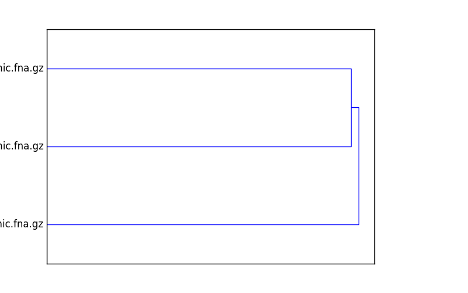

====================================
Using sourmash from the command line
====================================

From the command line, sourmash can be used to compute `MinHash
sketches <https://en.wikipedia.org/wiki/MinHash>`__ from DNA
sequences, compare them to each other, and plot the results.  This
allows you to estimate sequence similarity quickly and accurately.

Please see the `mash <http://mash.readthedocs.io/en/latest/>`__
software and the `mash paper (Ondov et al., 2016)
<http://biorxiv.org/content/early/2015/10/26/029827>`__ for background
information on how and why MinHash sketches work.

----

sourmash uses a subcommand syntax, so all commands start with
``sourmash`` followed by a subcommand specifying the action to be
taken.

.. contents::
   :depth: 3

An example
==========

Grab three bacterial genomes from NCBI::

   curl -L -O ftp://ftp.ncbi.nlm.nih.gov/genomes/refseq/bacteria/Escherichia_coli/reference/GCF_000005845.2_ASM584v2/GCF_000005845.2_ASM584v2_genomic.fna.gz
   curl -L -O ftp://ftp.ncbi.nlm.nih.gov/genomes/refseq/bacteria/Salmonella_enterica/reference/GCF_000006945.1_ASM694v1/GCF_000006945.1_ASM694v1_genomic.fna.gz
   curl -L -O ftp://ftp.ncbi.nlm.nih.gov/genomes/refseq/bacteria/Sphingobacteriaceae_bacterium_DW12/latest_assembly_versions/GCF_000783305.1_ASM78330v1/GCF_000783305.1_ASM78330v1_genomic.fna.gz

Compute signatures for each::

   sourmash compute *.fna.gz

This will produce three ``.sig`` files containing MinHash signatures at k=31.

Next, compare all the signatures to each other::

   sourmash compare *.sig -o cmp

Finally, plot a dendrogram::

   sourmash plot cmp

This will output two files, ``cmp.dendro.png`` and ``cmp.matrix.png``,
containing a clustering & dendrogram of the sequences, as well as a
similarity matrix and heatmap.

The ``sourmash`` command and its subcommands
============================================

To get a list of subcommands, run ``sourmash`` without any arguments.

There are three main subcommands: ``compute``, ``compare``, and ``plot``.

``sourmash compute``
--------------------

The ``compute`` subcommand computes and saves MinHash sketches for
each sequence in one or more sequence files.  It takes as input FASTA
or FASTQ files, and these files can be uncompressed or compressed with
gzip or bzip2.  The output will be one or more JSON signature files
that can be used with ``sourmash compare``.

Usage::

  sourmash compute filename [ filename2 ... ]

Optional arguments::

  --ksizes K1[,K2,K3] -- one or more k-mer sizes to use; default is 31
  --force -- recompute existing signatures; convert non-DNA characters to N
  --output -- save all the signatures to this file; can be '-' for stdout.

``sourmash compare``
--------------------

The ``compare`` subcommand compares one or more signature files
(created with ``compute``) using estimated `Jaccard index
<https://en.wikipedia.org/wiki/Jaccard_index>`__.  The default output
is a text display of a similarity matrix where each entry ``[i, j]``
contains the estimated Jaccard index between input signature ``i`` and
input signature ``j``.  The output matrix can be saved to a file
with ``--output`` and used with the ``sourmash plot`` subcommand.

Usage::

  sourmash compare file1.sig [ file2.sig ... ]

Options::

  --output -- save the distance matrix to this file (as a numpy binary matrix)
  --ksize -- do the comparisons at this k-mer size.

``sourmash plot``
-----------------

The ``plot`` subcommand produces two plots -- a dendrogram and a
dendrogram+matrix -- from a distance matrix computed by ``sourmash compare
--output <matrix>``.  The deafault output is two PNG files.

Usage::

  sourmash plot <matrix>

Options::

  --pdf -- output PDF files.
  --labels -- display the signature names (by default, the filenames) on the plot
  --indices -- turn off index display on the plot.
  --vmax -- maximum value (default 1.0) for heatmap.
  --vmin -- minimum value (deafult 0.0) for heatmap.
  --subsample=<N> -- plot a maximum of <N> samples, randomly chosen.
  --subsample-seed=<seed> -- seed for pseudorandom number generator.

Example figures:

.. figure:: _static/cmp.matrix.png
   :width: 60%

