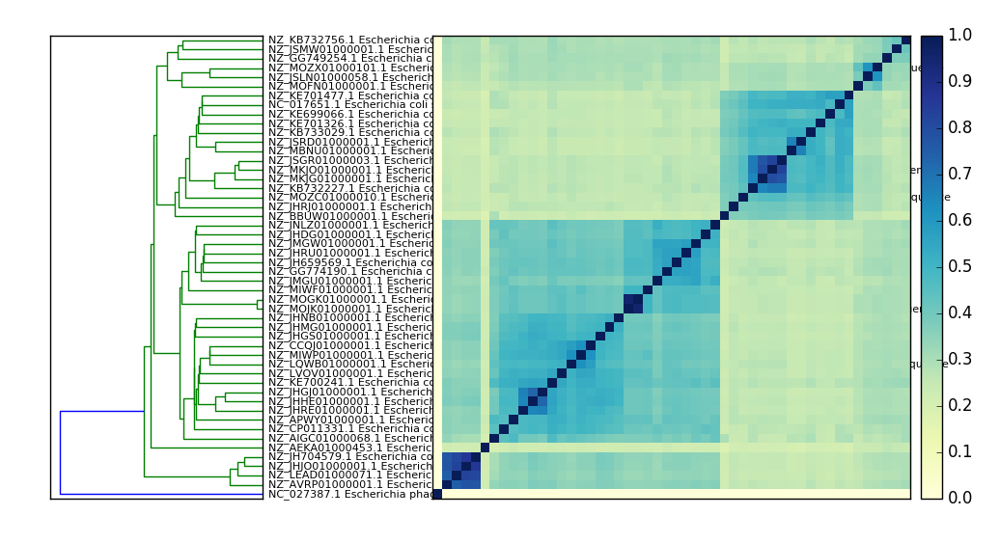

# The first sourmash tutorial - making signatures, comparing, and searching

This tutorial should run without modification on Linux or Mac OS X,
under [Miniconda](https://docs.conda.io/en/latest/miniconda.html).

You'll need about 5 GB of free disk space, and about 5 GB of RAM to
search GenBank.  The tutorial should take about 20 minutes total to
run. In fact, we have successfully tested it on
[binder.pangeo.io](https://binder.pangeo.io/v2/gh/binder-examples/r-conda/master?urlpath=urlpath%3Drstudio)
if you want to give it a try!

## Install miniconda

If you don't have the `conda` command installed, you'll need to install
miniconda for Python 3.x.

On Linux, this should work:
```
wget https://repo.continuum.io/miniconda/Miniconda3-latest-Linux-x86_64.sh
bash Miniconda3-latest-Linux-x86_64.sh -b
echo export PATH="$HOME/miniconda3/bin:$PATH" >> ~/.bash_profile
source ~/.bash_profile
```
otherwise, follow
[the miniconda install](https://docs.conda.io/en/latest/miniconda.html).

## Enable [bioconda](https://bioconda.github.io/)

```
conda config --add channels defaults
conda config --add channels bioconda
conda config --add channels conda-forge
```

## Install sourmash

To install sourmash, create a new environment named `smash` and install sourmash:

```
conda create -y -n smash sourmash
```

and then activate:
```
conda activate smash
```

You should now be able to use the `sourmash` command:

```
sourmash info
```

## Generate a signature for Illumina reads

Download some reads and a reference genome:

```
mkdir ~/data
cd ~/data
curl -L https://osf.io/ruanf/download -o ecoliMG1655.fa.gz
curl -L https://osf.io/q472x/download -o ecoli_ref-5m.fastq.gz
```

Compute a scaled signature from our reads:

```
mkdir ~/sourmash
cd ~/sourmash

sourmash sketch dna -p scaled=10000,k=31 ~/data/ecoli_ref*.fastq.gz -o ecoli-reads.sig
```

## Compare reads to assemblies

Use case: how much of the read content is contained in the reference genome?

Build a signature for an E. coli genome:

```
sourmash sketch dna -p scaled=1000,k=31 ~/data/ecoliMG1655.fa.gz -o ecoli-genome.sig
```

and now evaluate *containment*, that is, what fraction of the read content is
contained in the genome:

```
sourmash search ecoli-reads.sig ecoli-genome.sig --containment
```

and you should see:

```

select query k=31 automatically.
loaded query: /home/jovyan/data/ecoli_ref-5m... (k=31, DNA)
loaded 1 signatures.

1 matches:
similarity   match
----------   -----
 31.0%       /home/jovyan/data/ecoliMG1655.fa.gz
```


Try the reverse, too!

```
sourmash search ecoli-genome.sig ecoli-reads.sig --containment
```

## Make and search a database quickly.

Suppose that we have a collection of signatures (made with `sourmash
compute` as above) and we want to search it with our newly assembled
genome (or the reads, even!). How would we do that?

Let's grab a sample collection of 50 E. coli genomes and unpack it --

```
mkdir ecoli_many_sigs
cd ecoli_many_sigs

curl -O -L https://github.com/sourmash-bio/sourmash/raw/latest/data/eschericia-sigs.tar.gz

tar xzf eschericia-sigs.tar.gz
rm eschericia-sigs.tar.gz

cd ../

```

This will produce 50 files named `ecoli-N.sig` in the directory `ecoli_many_sigs/` --

```
ls ecoli_many_sigs
```

Let's turn this into an easily-searchable database with `sourmash index` --

```
sourmash index ecolidb ecoli_many_sigs/*.sig
```

and now we can search!

```
sourmash search ecoli-genome.sig ecolidb.sbt.zip -n 20
```

You should see output like this:

```
select query k=31 automatically.
loaded query: /home/ubuntu/data/ecoliMG1655.... (k=31, DNA)
loaded 0 signatures and 1 databases total.                                     

49 matches; showing first 20:
similarity   match
----------   -----
 75.9%       NZ_JMGW01000001.1 Escherichia coli 1-176-05_S4_C2 e117605...
 73.0%       NZ_JHRU01000001.1 Escherichia coli strain 100854 100854_1...
 71.9%       NZ_GG774190.1 Escherichia coli MS 196-1 Scfld2538, whole ...
 70.5%       NZ_JMGU01000001.1 Escherichia coli 2-011-08_S3_C2 e201108...
 69.8%       NZ_JH659569.1 Escherichia coli M919 supercont2.1, whole g...
 59.9%       NZ_JNLZ01000001.1 Escherichia coli 3-105-05_S1_C1 e310505...
 58.3%       NZ_JHDG01000001.1 Escherichia coli 1-176-05_S3_C1 e117605...
 56.5%       NZ_MIWF01000001.1 Escherichia coli strain AF7759-1 contig...
 56.1%       NZ_MOJK01000001.1 Escherichia coli strain 469 Cleandata-B...
 56.1%       NZ_MOGK01000001.1 Escherichia coli strain 676 BN4_676_1_(...
 50.5%       NZ_KE700241.1 Escherichia coli HVH 147 (4-5893887) acYxy-...
 50.3%       NZ_APWY01000001.1 Escherichia coli 178200 gec178200.conti...
 48.8%       NZ_LVOV01000001.1 Escherichia coli strain swine72 swine72...
 48.8%       NZ_MIWP01000001.1 Escherichia coli strain K6412 contig_00...
 48.7%       NZ_AIGC01000068.1 Escherichia coli DEC7C gecDEC7C.contig....
 48.2%       NZ_LQWB01000001.1 Escherichia coli strain GN03624 GCID_EC...
 48.0%       NZ_CCQJ01000001.1 Escherichia coli strain E. coli, whole ...
 47.3%       NZ_JHMG01000001.1 Escherichia coli O121:H19 str. 2010EL10...
 47.2%       NZ_JHGJ01000001.1 Escherichia coli O45:H2 str. 2009C-4780...
 46.5%       NZ_JHHE01000001.1 Escherichia coli O103:H2 str. 2009C-327...

```

## Compare many signatures and build a tree.

Compare all the things:

```
sourmash compare ecoli_many_sigs/* -o ecoli_cmp
```

Optionally, parallelize to 8 threads using `-p 8`:

```
sourmash compare -p 8 ecoli_many_sigs/* -o ecoli_cmp
```

and then plot:

```
sourmash plot --pdf --labels ecoli_cmp
```

which will produce files named `ecoli_cmp.matrix.pdf` and
`ecoli_cmp.dendro.pdf`.

Here's a PNG version:



## What's in my metagenome?

Download a database containing all of the GenBank microbial genomes:
```
curl -L -o genbank-k31.lca.json.gz https://osf.io/4f8n3/download
```

Next, run the 'gather' command to see what's in your ecoli genome --
```
sourmash gather ecoli-genome.sig genbank-k31.lca.json.gz
```

and you should get:

```
loaded query: /home/diblions/data/ecoliMG165... (k=31, DNA)
loading from genbank-k31.lca.json.gz...
loaded 1 databases.


overlap     p_query p_match
---------   ------- -------
4.9 Mbp      100.0%  100.0%    LRDF01000001.1 Escherichia coli strai...

found 1 matches total;
the recovered matches hit 100.0% of the query
```

In this case, the output is kind of boring because this is a single
genome.  But! You can use this on metagenomes (assembled and
unassembled) as well; you've just got to make the signature files.

To see this in action, here is gather running on a signature generated
from some sequences that assemble (but don't align to known genomes)
from the
[Shakya et al. 2013 mock metagenome paper.][2]

```
wget https://github.com/sourmash-bio/sourmash/raw/latest/doc/_static/shakya-unaligned-contigs.sig
sourmash gather -k 31 shakya-unaligned-contigs.sig genbank-k31.lca.json.gz
```

This should yield:
```
loaded query: mqc500.QC.AMBIGUOUS.99.unalign... (k=31, DNA)
loaded 1 databases.


overlap     p_query p_match
---------   ------- -------
1.4 Mbp       11.0%   58.0%    JANA01000001.1 Fusobacterium sp. OBRC...
1.0 Mbp        7.7%   25.9%    CP001957.1 Haloferax volcanii DS2 pla...
0.9 Mbp        7.4%   11.8%    BA000019.2 Nostoc sp. PCC 7120 DNA, c...
0.7 Mbp        5.9%   23.0%    FOVK01000036.1 Proteiniclasticum rumi...
0.7 Mbp        5.3%   17.6%    AE017285.1 Desulfovibrio vulgaris sub...
0.6 Mbp        4.9%   11.1%    CP001252.1 Shewanella baltica OS223, ...
0.6 Mbp        4.8%   27.3%    AP008226.1 Thermus thermophilus HB8 g...
0.6 Mbp        4.4%   11.2%    CP000031.2 Ruegeria pomeroyi DSS-3, c...
480.0 kbp      3.8%    7.6%    CP000875.1 Herpetosiphon aurantiacus ...
410.0 kbp      3.3%   10.5%    CH959317.1 Sulfitobacter sp. NAS-14.1...
1.4 Mbp        2.2%   11.8%    LN831027.1 Fusobacterium nucleatum su...
0.5 Mbp        2.1%    5.3%    CP000753.1 Shewanella baltica OS185, ...
420.0 kbp      1.9%    7.7%    FNDZ01000023.1 Proteiniclasticum rumi...
150.0 kbp      1.2%    4.6%    AE000513.1 Deinococcus radiodurans R1...
150.0 kbp      1.2%    8.2%    CP000969.1 Thermotoga sp. RQ2, comple...
290.0 kbp      1.1%    4.1%    CH959311.1 Sulfitobacter sp. EE-36 sc...
1.2 Mbp        1.0%    5.0%    CP013328.1 Fusobacterium nucleatum su...
110.0 kbp      0.9%    3.7%    FRDZ01000215.1 Enterococcus faecalis ...
0.6 Mbp        0.8%    2.8%    CP000527.1 Desulfovibrio vulgaris DP4...
70.0 kbp       0.6%    1.2%    CP000850.1 Salinispora arenicola CNS-...
340.0 kbp      0.6%    3.3%    KQ235732.1 Fusobacterium nucleatum su...
60.0 kbp       0.5%    0.7%    CP000270.1 Burkholderia xenovorans LB...
50.0 kbp       0.4%    2.6%    CP001080.1 Sulfurihydrogenibium sp. Y...
50.0 kbp       0.4%    3.2%    L77117.1 Methanocaldococcus jannaschi...
found less than 40.0 kbp in common. => exiting

found 24 matches total;
the recovered matches hit 73.1% of the query

```

If you use the `-o` flag, gather will write out a csv that contains additional information. The column headers and their meanings are:  

+ `intersect_bp`: the approximate number of base pairs in common between the query and the match  
+ `f_orig_query`: fraction of original query; the fraction of the original query that is contained within the match  
+ `f_match`: fraction of match; the fraction of the match that is contained within the query  
+ `f_unique_to_query`: fraction unique to query; the fraction of the query that uniquely overlaps with the match  
+ `f_unique_weighted`: fraction unique to query weighted by abundance; fraction unique to query, weighted by abundance in the query     

It is straightforward to build your own databases for use with `search`
and `gather`; see `sourmash index`, above, [the LCA tutorial][4], or
[our notebook on working with private collections of signatures][5].

[Return to index][3]

[0]:http://ivory.idyll.org/blog/2016-sourmash-sbt-more.html
[1]:databases.md
[2]:https://www.ncbi.nlm.nih.gov/pubmed/233877
[3]:index.md
[4]:tutorials-lca.md
[5]:sourmash-collections.md
