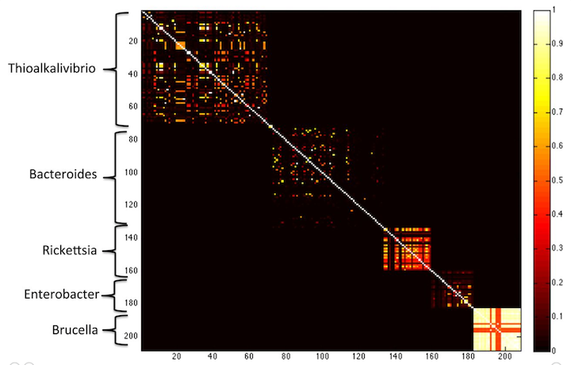
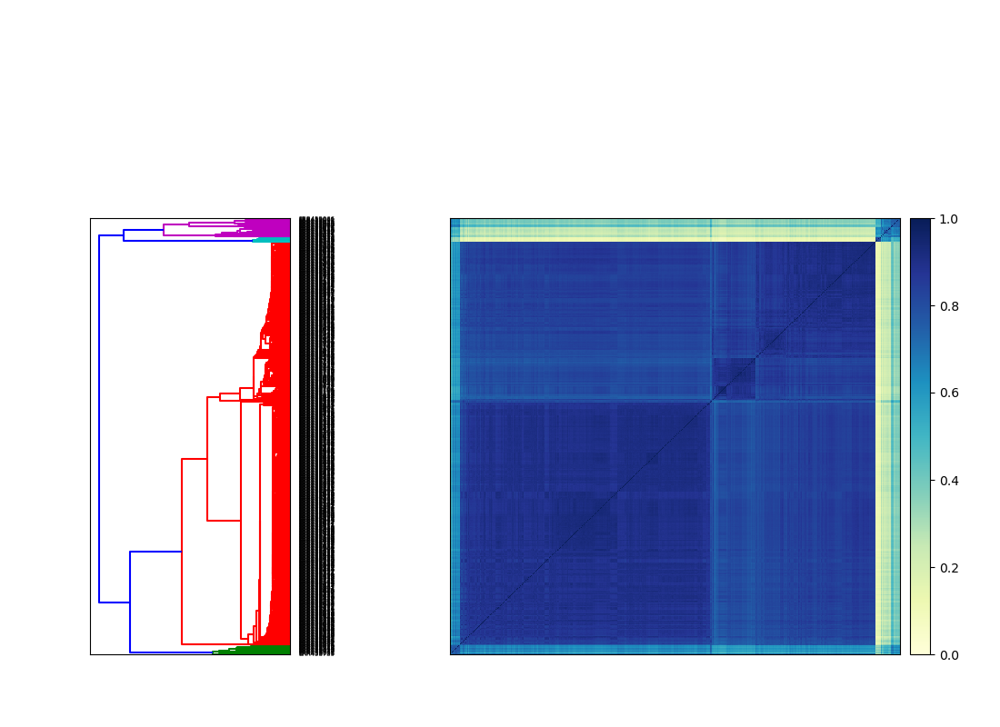

# Quick Insights from Sequencing Data with sourmash

## Objectives
1. Discuss k-mers and their utility
2. Compare RNA-seq samples quickly
3. Detect eukaryotic contamination in raw RNA-seq reads
4. Compare reads to an assembly
5. Build your own database for searching 
6. Other sourmash databases

## Introduction to k-mers

A "k-mer" is a word of DNA that is k long:

```
ATTG - a 4-mer
ATGGAC - a 6-mer
```

Typically we extract k-mers from genomic assemblies or read data sets by running a k-length window across all of the reads and sequences -- e.g. given a sequence of length 16, you could extract 11 k-mers of length six from it like so:

```
AGGATGAGACAGATAG
```
becomes the following set of 6-mers:
```
AGGATG
 GGATGA
  GATGAG
   ATGAGA
    TGAGAC
     GAGACA
      AGACAG
       GACAGA
        ACAGAT
         CAGATA
          AGATAG
```

Today we will be using a tool called [sourmash](https://f1000research.com/articles/8-1006) 
to explore k-mers!

## Why k-mers, though? Why not just work with the full read sequences?

Computers *love* k-mers because there's no ambiguity in matching them. You either have an exact match, or you don't. And computers love that sort of thing!

Basically, it's really easy for a computer to tell if two reads share a k-mer, and it's pretty easy for a computer to store all the k-mers that it sees in a pile of reads or in a genome.

## Long k-mers are species specific

k-mers are most useful when they're *long*, because then they're *specific*. That is, if you have a 31-mer taken from a human genome, it's pretty unlikely that another genome has that exact 31-mer in it.  (You can calculate the probability if you assume genomes are random: there are 4<sup>31</sup> possible 31-mers, and 4<sup>31</sup> = 4,611,686,018,427,387,904\.  So, you know, a lot.)

Essentially, *long k-mers are species specific*. Check out this figure from the [MetaPalette paper](http://msystems.asm.org/content/1/3/e00020-16):

<center></center>  
<br>

Here, Koslicki and Falush show that k-mer similarity works to group microbes by genus, at k=40\. If you go longer (say k=50) then you get only very little similarity between different species.

## Using k-mers to compare samples

So, one thing you can do is use k-mers to compare read data sets to read data sets, or genomes to genomes: data sets that have a lot of similarity probably are similar or even the same genome.

One metric you can use for this comparisons is the Jaccard distance, which is calculated by asking how many k-mers are *shared* between two samples vs how many k-mers in total are in the combined samples.

```
only k-mers in both samples
----------------------------
all k-mers in either or both samples
```

A Jaccard distance of 1 means the samples are identical; a Jaccard distance of 0 means the samples are completely different.

Jaccard distance works really well when we don't care how many times we see a k-mer. 
When we keep track of the abundance of a k-mer, say for example in RNA-seq samples where the number of read counts matters, we use cosine distance instead. 

These two measures can be used to search databases, compare RNA-seq samples, and all sorts of other things!  The only real problem with it is that there are a *lot* of k-mers in a genome -- a 5 Mbp genome (like E. coli) has 5 m k-mers!

About two years ago, [Ondov et al. (2016)](https://genomebiology.biomedcentral.com/articles/10.1186/s13059-016-0997-x) showed that [MinHash approaches](https://en.wikipedia.org/wiki/MinHash) could be used to estimate Jaccard distance using only a small fraction (1 in 10,000 or so) of all the k-mers.

The basic idea behind MinHash is that you pick a small subset of k-mers to look at, and you use those as a proxy for *all* the k-mers.  The trick is that you pick the k-mers randomly but consistently: so if a chosen k-mer is present in two data sets of interest, it will be picked in both. This is done using a clever trick that we can try to explain to you in class - but either way, trust us, it works!

We have implemented a MinHash approach in our [sourmash software](https://github.com/dib-lab/sourmash/), which can do some nice things with samples.  We'll show you some of these things next!

## Installing sourmash

To install sourmash, run:

```
conda install -y -c conda-forge -c bioconda sourmash
```

## Creating signatures

A signature is a compressed representation of the k-mers in the sequence. 

Depending on your application, we recommend different ways of preparing sequencing data to create a signature. 

In a genome or transcriptome, we expect that the k-mers we see are accurate. We can create 
signatures from these type of sequencing data sets without any preparation. We demonstrate
how to create a signature from high-quality sequences below.

First, download a genome assembly:

```
cd ~
mkdir sourmash_data
cd sourmash_data

curl -L https://osf.io/963dg/download -o ecoliMG1655.fa.gz 
gunzip -c ecoliMG1655.fa.gz | head
```

Compute a scaled MinHash from the assembly:

```
sourmash compute -k 21,31,51 --scaled 2000 --track-abundance -o ecoliMG1655.sig ecoliMG1655.fa.gz
```

For raw sequencing reads, we expect that many of the unique k-mers we observe will be due
to errors in sequencing. Unlike with high-quality sequences like transcriptomes and 
genomes, we need to think carefully about how we want to create each signature, as it will
depend on the downstream application. 

+ **Comparing reads against high quality sequences**: Because our references that we are
comparing or searching against only contain k-mers that are likely real, we don't want to 
trim potentially erroneous k-mers. Although most of the k-mers would be errors that we 
would trim, there is a chance we could accidentally remove **real** biological variation
that is present at low abundance. Instead, we only want to trim adapters.
+ **Comparing reads against other reads**: Because both datasets likely have many 
erroneous k-mers, we want to remove the majority of these so as not to falsely deflate
similarity between samples. Therefore, we want to trim what are likely erroneous k-mers 
from sequencing errors, as well as adapters.

Let's download some raw sequencing reads and demonstrate what k-mer trimming looks like. 

First, download a read file:

```
curl -L https://osf.io/pfxth/download -o ERR458584.fq.gz
gunzip -c ERR458584.fq.gz | head
```

Next, perform k-mer trimming using a library called khmer. K-mer trimming removes
low-abundant k-mers from the sample.

```
trim-low-abund.py ERR458584.fq.gz -V -Z 10 -C 3 --gzip -M 3e9 -o ERR458584.khmer.fq.gz
```

Finally, calculate a signature from the trimmed reads.
```
sourmash compute -k 21,31,51 --scaled 2000 --track-abundance -o ERR458584.khmer.sig ERR458584.khmer.fq.gz
```

[](_static/Sourmash_flow_diagrams_QC.png)


[](_static/Sourmash_flow_diagrams_compute.png)

We can prepare signatures like this for any sequencing data file! For the rest of the 
tutorial, we have prepared signatures for each sequencing data set we will be working
with.

## Compare many RNA-seq samples quickly

Use case: how similar are my samples to one another?

Traditionally in RNA-seq workflows, we use MDS plots to determine how similar our samples
are. Samples that are closer together on the MDS plot are more similar. However, to get
to this point, we have to trim our reads, download or build a reference transcriptome,
quantify our reads using a tool like Salmon, and then read the counts into R and make an
MDS plot. This is a lot of steps to go through just to figure out how similar your samples
are! 

Luckily, we can use sourmash to quickly compare how similar our samples are. 

We [generated signatures](https://github.com/taylorreiter/yeast-rna-sigs/blob/master/Snakefile) 
for the majority of the rest of the 
[Schurch et al. experiment](https://www.ncbi.nlm.nih.gov/pmc/articles/PMC4878611/) we 
have been working with this week. Below we download and compare the 647 signatures, and
then produce a plot that shows how similar they are to one another.

First, download and uncompress the signatures.

```
curl -o schurch_sigs.tar.gz -L https://osf.io/p3ryg/download
tar xf schurch_sigs.tar.gz
```

Next, compare the signatures using sourmash.

```
sourmash compare -k 31 -o schurch_compare_matrix schurch_sigs/*sig
```

This outputs a comparison matrix and a set of labels. The matrix is symmetrical, and 
contains numbers 0-1 that captures similarity between samples. 0 means there are no 
k-mers in common between two samples, while 1 means all k-mers are shared.

Lastly, we plot the comparison matrix.

```
sourmash plot --labels schurch_compare_matrix
```

<center></center>  
<br>

We see there are two major blocks of similar samples, which makes sense given that we have
WT and SNF2 knockout samples. However, we also see that some of our samples are outliers!
If this were our experiment, we would want to investigate the outliers further to see 
what caused them to be so dissimilar.

## Detect Eukaryotic Contamination in Raw RNA Sequencing data

Use case: Search for the presence of unexpected organisms in raw RNA-seq reads 

For most analysis pipelines, there are many steps that need to be executed before we get 
to the analysis and interpretation of what is in our sample. This often means we are 10-15
steps into our analysis before we find any problems. However, if our reads contain 
contamination, we want to know that as quickly as possible so we can remove the
contamination and solve any issues that led to the contamination.

Using sourmash, we can quickly check if we have any unexpected organisms in our sequencing
samples. We do this by comparing a signature from our reads against a database of known 
signatures from publicly available reference sequences.
 
We have generated sourmash databases for all publicly available Eukaryotic RNA samples
(we used the `*rna_from_genomic*` files from RefSeq and Genbank...however keep in mind
that not all sequenced genomes have these files!). This database includes
fungi, plants, vertebrates, invertebrates, and protazoa. It does not include human, so we
incorporate that separately. We also built another database of the ~700 recently 
[re-assembled](https://academic.oup.com/gigascience/article/8/4/giy158/5241890)  marine 
transcriptomes from the 
[MMETSP project](https://journals.plos.org/plosbiology/article?id=10.1371/journal.pbio.1001889). 
These databases allow us to detect common organisms that might be unexpectedly present
in our sequencing data. 

First, let's download and uncompress our three databases: human, MMETSP, and everything 
else!

```
wget -O sourmash_euk_rna_db.tar.gz https://osf.io/vpk8s/download
tar xf sourmash_euk_rna_db.tar.gz
```

Next, let's download a signature from some sequencing reads. We'll work with some 
sequencing reads from a wine fermentation. 

```
wget -O wine.sig https://osf.io/5vsjq/download
```

We expected fungus and grape to be metabolically active in these samples. Let's check 
which organisms we detect.

```
sourmash gather -k 31 --scaled 2000 -o wine.csv wine.sig sourmash_euk_rna_db/*sbt.json sourmash_euk_rna_db/*sig  
```

If we take a look at the output, we see:

```
== This is sourmash version 2.0.1. ==
== Please cite Brown and Irber (2016), doi:10.21105/joss.00027. ==

loaded query: wine_fermentation... (k=31, DNA)
downsampling query from scaled=2000 to 2000
loaded 1 signatures and 2 databases total.


overlap     p_query p_match avg_abund
---------   ------- ------- ---------
2.2 Mbp       79.0%   28.5%     122.2     Sc_YJM1477_v1  Saccharomyces cerevis...
0.8 Mbp        1.4%    2.2%       6.2     12X  Vitis vinifera (wine grape)
2.1 Mbp        0.4%    1.6%       9.3     GLBRCY22-3  Saccharomyces cerevisiae...
124.0 kbp      0.1%    0.7%       3.1     Aureobasidium pullulans var. pullula...
72.0 kbp       0.0%    0.1%       1.9     Mm_Celera  Mus musculus (house mouse)
1.9 Mbp        0.0%    0.5%       3.7     Sc_YJM1460_v1  Saccharomyces cerevis...
1.8 Mbp        0.1%    0.5%      14.1     ASM18217v1  Saccharomyces cerevisiae...
2.1 Mbp        0.1%    0.3%      17.7     R008  Saccharomyces cerevisiae R008 ...
1.9 Mbp        0.0%    0.1%       3.1     ASM32610v1  Saccharomyces cerevisiae...
found less than 18.0 kbp in common. => exiting

found 9 matches total;
the recovered matches hit 81.2% of the query
```

...which is almost exactly what we expect, except we see some house mouse! And I promise
Ratatouille was not making this wine.

Using this method, we have now identified contamination in our reads. We could align to
the mouse genome to remove these reads, however the best strategy to remove these reads
may vary on a case by case basis.  

## Compare reads to assemblies

Use case: how much of the read content is contained in the reference genome?

First we’ll download some reads from an E. coli genome, then we will generate a signature from them

```
curl -L https://osf.io/frdz5/download -o ecoli_ref-5m.fastq.gz
sourmash compute  -k 31 --scaled 2000 ~/sourmash_data/ecoli_ref-5m.fastq.gz -o ecoli-reads.sig
```

[](_static/Sourmash_flow_diagrams_search.png)

Build a signature for an E. coli genome:

```
sourmash compute --scaled 2000 -k 31 ~/sourmash_data/ecoliMG1655.fa.gz -o ecoli-genome.sig
```

and now evaluate *containment*, that is, what fraction of the read content is
contained in the genome:

```
sourmash search -k 31 ecoli-reads.sig ecoli-genome.sig --containment
```

and you should see:

```
loaded query: /home/diblions/data/ecoli_ref-... (k=31, DNA)
loaded 1 signatures.

1 matches:
similarity   match
----------   -----
  9.7%       /home/diblions/data/ecoliMG1655.fa.gz
```

Why are only 10% or so of our k-mers from the reads in the genome!?
Any ideas?

Try the reverse - why is it bigger?

```
sourmash search -k 31 ecoli-genome.sig ecoli-reads.sig --containment
```

(...but 100% of our k-mers from the genome are in the reads!?)


## Make and search a database quickly.

Suppose that we have a collection of signatures (made with `sourmash
compute` as above) and we want to search it with our newly assembled
genome (or the reads, even!). How would we do that?

Let's grab a sample collection of 50 E. coli genomes and unpack it --

```
mkdir ecoli_many_sigs
cd ecoli_many_sigs

curl -O -L https://github.com/dib-lab/sourmash/raw/master/data/eschericia-sigs.tar.gz

tar xzf eschericia-sigs.tar.gz
rm eschericia-sigs.tar.gz

cd ../
```

This will produce 50 files named `ecoli-N.sig` in the `ecoli_many_sigs` --

```
ls ecoli_many_sigs
```

Let's turn this into an easily-searchable database with `sourmash index` --

```
sourmash index -k 31 ecolidb ecoli_many_sigs/*.sig
```
What does the database look like and how does the search work?


One point to make with this is that the search can quickly narrow down
which signatures match your query, without losing any matches.  It's a
clever example of how computer scientists can actually make life
better :).

----

And now we can search!

```
sourmash search ecoli-genome.sig ecolidb.sbt.json -n 20
```

You should see output like this:

```
# running sourmash subcommand: search
select query k=31 automatically.
loaded query: /home/tx160085/data/ecoliMG165... (k=31, DNA)
loaded SBT ecolidb.sbt.json
Searching SBT ecolidb.sbt.json
49 matches; showing first 20:
similarity   match
----------   -----
 75.9%       NZ_JMGW01000001.1 Escherichia coli 1-176-05_S4_C2 e117605...
 73.0%       NZ_JHRU01000001.1 Escherichia coli strain 100854 100854_1...
 71.9%       NZ_GG774190.1 Escherichia coli MS 196-1 Scfld2538, whole ...
 70.5%       NZ_JMGU01000001.1 Escherichia coli 2-011-08_S3_C2 e201108...
 69.8%       NZ_JH659569.1 Escherichia coli M919 supercont2.1, whole g...
 59.9%       NZ_JNLZ01000001.1 Escherichia coli 3-105-05_S1_C1 e310505...
 58.3%       NZ_JHDG01000001.1 Escherichia coli 1-176-05_S3_C1 e117605...
 56.5%       NZ_MIWF01000001.1 Escherichia coli strain AF7759-1 contig...
 56.1%       NZ_MOJK01000001.1 Escherichia coli strain 469 Cleandata-B...
 56.1%       NZ_MOGK01000001.1 Escherichia coli strain 676 BN4_676_1_(...
 50.5%       NZ_KE700241.1 Escherichia coli HVH 147 (4-5893887) acYxy-...
 50.3%       NZ_APWY01000001.1 Escherichia coli 178200 gec178200.conti...
 48.8%       NZ_LVOV01000001.1 Escherichia coli strain swine72 swine72...
 48.8%       NZ_MIWP01000001.1 Escherichia coli strain K6412 contig_00...
 48.7%       NZ_AIGC01000068.1 Escherichia coli DEC7C gecDEC7C.contig....
 48.2%       NZ_LQWB01000001.1 Escherichia coli strain GN03624 GCID_EC...
 48.0%       NZ_CCQJ01000001.1 Escherichia coli strain E. coli, whole ...
 47.3%       NZ_JHMG01000001.1 Escherichia coli O121:H19 str. 2010EL10...
 47.2%       NZ_JHGJ01000001.1 Escherichia coli O45:H2 str. 2009C-4780...
 46.5%       NZ_JHHE01000001.1 Escherichia coli O103:H2 str. 2009C-327...

```

identifying what genome is in the signature. Some pretty good matches but nothing above %75. Why? What are some things we should think about when we're doing taxonomic classification? 

## What's in my metagenome?

First, let's download and upack the database we'll use for classification
```
cd ~/sourmash_data
curl -L https://osf.io/4f8n3/download -o genbank-k31.lca.json.gz
gunzip genbank-k31.lca.json.gz
```

This database is a GenBank index of all
the microbial genomes
-- this one contains sketches of all 87,000 microbial genomes (including viral and fungal). See
[available sourmash databases](http://sourmash.rtfd.io/en/latest/databases.html)
for more information.

After this database is unpacked, it produces a file
`genbank-k31.lca.json`.

Next, run the 'lca gather' command to see what's in your ecoli genome --
```
sourmash lca gather ecoli-genome.sig genbank-k31.lca.json
```

and you should get:

```
loaded 1 LCA databases. ksize=31, scaled=10000
loaded query: /home/diblions/data/ecoliMG165... (k=31)

overlap     p_query p_match 
---------   ------- --------
4.9 Mbp     100.0%    2.3%      Escherichia coli

Query is completely assigned.
```

In this case, the output is kind of boring because this is a single
genome.  But! You can use this on metagenomes (assembled and
unassembled) as well; you've just got to make the signature files.

To see this in action, here is gather running on a signature generated
from some sequences that assemble (but don't align to known genomes)
from the
[Shakya et al. 2013 mock metagenome paper](https://www.ncbi.nlm.nih.gov/pubmed/23387867).

```
wget https://github.com/dib-lab/sourmash/raw/master/doc/_static/shakya-unaligned-contigs.sig
sourmash lca gather shakya-unaligned-contigs.sig genbank-k31.lca.json
```

This should yield:
```
loaded 1 LCA databases. ksize=31, scaled=10000
loaded query: mqc500.QC.AMBIGUOUS.99.unalign... (k=31)

overlap     p_query p_match 
---------   ------- --------
1.8 Mbp      14.6%    9.1%      Fusobacterium nucleatum
1.0 Mbp       7.8%   16.3%      Proteiniclasticum ruminis
1.0 Mbp       7.7%   25.9%      Haloferax volcanii
0.9 Mbp       7.4%   11.8%      Nostoc sp. PCC 7120
0.9 Mbp       7.0%    5.8%      Shewanella baltica
0.8 Mbp       6.0%    8.6%      Desulfovibrio vulgaris
0.6 Mbp       4.9%   12.6%      Thermus thermophilus
0.6 Mbp       4.4%   11.2%      Ruegeria pomeroyi
480.0 kbp     3.8%    7.6%      Herpetosiphon aurantiacus
410.0 kbp     3.3%   10.5%      Sulfitobacter sp. NAS-14.1
150.0 kbp     1.2%    4.5%      Deinococcus radiodurans (** 1 equal matches)
150.0 kbp     1.2%    8.2%      Thermotoga sp. RQ2
140.0 kbp     1.1%    4.1%      Sulfitobacter sp. EE-36
130.0 kbp     1.0%    0.7%      Streptococcus agalactiae (** 1 equal matches)
100.0 kbp     0.8%    0.3%      Salinispora arenicola (** 1 equal matches)
100.0 kbp     0.8%    4.2%      Fusobacterium sp. OBRC1
60.0 kbp      0.5%    0.7%      Paraburkholderia xenovorans
50.0 kbp      0.4%    3.2%      Methanocaldococcus jannaschii (** 2 equal matches)
50.0 kbp      0.4%    0.3%      Bacteroides vulgatus (** 1 equal matches)
50.0 kbp      0.4%    2.6%      Sulfurihydrogenibium sp. YO3AOP1
30.0 kbp      0.2%    0.7%      Fusobacterium hwasookii (** 3 equal matches)
30.0 kbp      0.2%    0.0%      Pseudomonas aeruginosa (** 2 equal matches)
30.0 kbp      0.2%    1.6%      Persephonella marina (** 1 equal matches)
30.0 kbp      0.2%    0.4%      Zymomonas mobilis
20.0 kbp      0.2%    1.1%      Sulfurihydrogenibium yellowstonense (** 6 equal matches)
20.0 kbp      0.2%    0.5%      Ruminiclostridium thermocellum (** 5 equal matches)
20.0 kbp      0.2%    0.1%      Streptococcus parasanguinis (** 4 equal matches)
20.0 kbp      0.2%    0.8%      Fusobacterium sp. HMSC064B11 (** 2 equal matches)
20.0 kbp      0.2%    0.4%      Chlorobium phaeobacteroides (** 1 equal matches)
20.0 kbp      0.2%    0.7%      Caldicellulosiruptor bescii
10.0 kbp      0.1%    0.0%      Achromobacter xylosoxidans (** 53 equal matches)
10.0 kbp      0.1%    0.2%      Geobacter sulfurreducens (** 17 equal matches)
10.0 kbp      0.1%    0.5%      Fusobacterium sp. HMSC065F01 (** 15 equal matches)
10.0 kbp      0.1%    0.3%      Nitrosomonas europaea (** 14 equal matches)
10.0 kbp      0.1%    0.5%      Wolinella succinogenes (** 13 equal matches)
10.0 kbp      0.1%    0.5%      Thermotoga neapolitana (** 12 equal matches)
10.0 kbp      0.1%    0.5%      Thermus amyloliquefaciens (** 10 equal matches)
10.0 kbp      0.1%    0.1%      Desulfovibrio desulfuricans (** 9 equal matches)
10.0 kbp      0.1%    0.4%      Fusobacterium sp. CM22 (** 8 equal matches)
10.0 kbp      0.1%    0.2%      Desulfovibrio piger (** 7 equal matches)
10.0 kbp      0.1%    0.5%      Thermus kawarayensis (** 6 equal matches)
10.0 kbp      0.1%    0.5%      Pyrococcus furiosus (** 5 equal matches)
10.0 kbp      0.1%    0.5%      Aciduliprofundum boonei (** 4 equal matches)
10.0 kbp      0.1%    0.2%      Desulfovibrio sp. A2 (** 3 equal matches)
10.0 kbp      0.1%    0.3%      Desulfocurvus vexinensis (** 2 equal matches)
10.0 kbp      0.1%    0.0%      Enterococcus faecalis

22.1% (2.8 Mbp) of hashes have no assignment.

``` 

What do the columns here mean?

Why might some of things in a metagenome be unassigned?

----

It is straightforward to build your own databases for use with
`search` and `lca gather`; this is of interest if you have dozens or
hundreds of sequencing data sets in your group. Ping us if you want us
to write that up.

## Final thoughts on sourmash

There are many tools like Kraken and Kaiju that can do taxonomic
classification of individual reads from metagenomes; these seem to
perform well (albeit with high false positive rates) in situations
where you don't necessarily have the genome sequences that are in the
metagenome.  Sourmash, by contrast, can estimate which known genomes are
actually present, so that you can extract them and map/align to them.
It seems to have a very low false positive rate and is quite sensitive
to strains.

Above, we've shown you a few things that you can use sourmash for.  Here
is a (non-exclusive) list of other uses that we've been thinking about --

* detect contamination in sequencing data;

* index and search private sequencing collections;

* search all of SRA for overlaps in metagenomes

